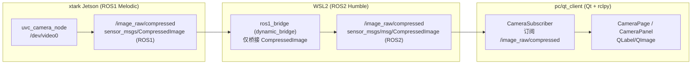

# PC 端摄像头模块与 ROS2 视觉演进方案

最后更新：2026-06-26

目标：在 `pc/qt_client` 的**摄像头模块**里承接 RGB/深度相机显示、诊断、ROS2/RViz 展示和后续视觉算法联调；xtark 侧尽量只作为硬件采集平台，算法、转换、可视化和较重的业务逻辑优先放到 PC/WSL2/ROS2 侧，降低后续对接其他硬件平台的难度。

本文同时记录当前 Qt 摄像头页状态、机器人侧采集边界、WSL2/ROS2 演进路线、可迁移 demo 清单和历史 Android 对齐背景。

## 0. 当前落地状态（2026-06-25）

当前判断：**Qt 摄像头页已经具备可用的相机显示能力**，现阶段不再以继续追 Android 栈为主线；Android 栈视为冻结参考，后续视觉能力主要沿 Qt 摄像头模块和 WSL2/ROS2 方向演进。

- Android 侧保留为历史可用栈和行为参考，不再作为新功能主承载面。
- xtark 侧尽量只做硬件采集：相机驱动、原始 RGB/Depth/CameraInfo/PointCloud/必要 TF 发布。
- WSL2/ROS2 侧优先承载算法和大头逻辑：图像转换、深度可视化、点云/局部占用图处理、SLAM/检测/跟踪 demo 迁移、RViz 展示。
- Qt 侧以**摄像头模块**为主承载界面：多路预览、状态诊断、算法结果展示、RViz/ROS2 联调入口、必要的轻量控制。
- Qt 侧当前以 HTTP/MJPEG 为主，默认通过 `web_video_server` 拉取 `/camera/image_raw`。
- 因此当前状态应描述为：**基础看图能力已可用，后续重点转为 ROS2 化、模块化展示和跨硬件可迁移**。
- 后续深度相机增强应建立在现有 Qt 摄像头页之上，不应推倒重做 RGB 预览。

Phase 0 **HTTP/MJPEG 看图方案已落地并实机出图**。当前 PC Qt 新版 Shell 在进入机器人工作区后，可切换到“摄像头”页并自动连接机器人端 `web_video_server`。

当前已实现代码结构：

```text
CameraPage
  ├─ CameraToolbar           URL、连接/断开/重连、FPS、状态
  ├─ CameraViewModeBar       RGB / Depth / 分屏切换
  ├─ CameraViewport          RGB/Depth/分屏预览（Depth 无流时显示占位）
  ├─ CameraDepthPanel        深度 topic / 深度流状态
  ├─ CameraRos2Panel         Bridge + RGB-D topic 状态 + RViz2 入口
  ├─ TelemetryDetailsStrip   机器人遥测状态
  └─ ManualControlStrip      PC 化按钮遥控

MjpegStreamController
  ├─ CameraPage（RGB + PC/Qt raw depth preview，MJPEG fallback 可选）
  └─ CameraPanel            --legacy 旧调试台相机面板

core/camera_*
  ├─ camera_topics.py              RGB-D topic 常量
  ├─ camera_topic_probe.py         ROS2 topic 探测（子进程，非 UI 线程）
  ├─ camera_ros2_bridge_*          MJPEG -> /camera/image_raw Bridge
  └─ config/xtark_rgbd_camera.rviz TF / PointCloud2 / Camera / Marker
```

**Phase 1.0（2026-06-25）已落地：RGB-D 预览结构 + ROS2/RViz 诊断 + topic 状态展示。**

- Qt 摄像头页可切换 RGB / Depth / 分屏；Depth 未接入时显示「深度相机未接入 / 无深度流」，不阻塞 UI。
- ROS2 诊断区展示 `/camera/image_raw`、`/camera/depth/*`、`/camera/depth_registered/points` 在线/频率。
- 提供 `config/xtark_rgbd_camera.rviz` 与摄像头页「启动 RViz2」入口（TF、点云、RGB/Depth 图像、后续 Marker）。
- `qt_stack.sh status` 增加 RGB-D topic 检查；深度 MJPEG 预览只作为 fallback 诊断；**默认不启动**深度算法。
- **明确不做**：Android 栈、用深度 scan 替换主 `/scan`、move_base 避障、JSON 8765 传点云、Qt UI 线程跑算法、RTAB-Map。

**Phase 1.5（RGB+Depth 双预览，Qt 双渲染）**

目标：Qt 摄像头页必须同时可看 RGB 和 Depth。RGB 保持 `:8080` MJPEG；Depth 统一从 xtark `:8082` 拉取 `16UC1` raw frame，由 PC/Qt 本地伪彩渲染和计算距离。不要再使用 ROS1->ROS2 Docker bridge、深度 MJPEG 或 JSON 传图。

xtark 侧固定两档：

- `PROFILE=camera_raw`：低负载，发布 RGB、depth raw、camera_info，并启动 `:8082` raw depth HTTP；不启动 `xtark_depth_preview`。
- `PROFILE=camera_preview`：保留为兼容别名，行为与 `camera_raw` 一致，不再启动深度 MJPEG preview。
- 两档都保留 bringup、JSON `:8765`、RGB `:8080`、Depth raw。
- 不在 xtark 上做楼梯、墙面、障碍物、点云分割、3D 地图等算法。

PC/Qt 侧新增：

- 新增 raw depth source / worker，优先订阅 ROS2 `/camera/depth/image_raw` 与 `/camera/depth/camera_info`。
- 支持 `16UC1`，必要时兼容 `32FC1`。
- 在 worker 中完成深度 clip、无效值过滤、伪彩色/灰度 preview、中心距离、最近有效距离、有效像素比例、FPS、延迟统计。
- Depth / 分屏优先显示 PC/Qt 生成的 preview。
- Qt Depth worker 从 `http://<xtark>:8082/v1/depth/latest` 拉取 raw frame；`/v1/depth/camera_info` 提供标定参数。

建议新增文件：

```text
pc/qt_client/core/camera_depth_frame.py
pc/qt_client/core/camera_depth_colormap.py
pc/qt_client/core/camera_depth_source.py
pc/qt_client/core/camera_depth_worker.py
```

Phase 1.5 **不做**：楼梯识别、墙面识别、障碍物分类、点云分割、3D 地图、局部地图 widget、导航接入、`/scan`、`/odom_laser`、move_base costmap、RTAB-Map、ORB-SLAM2、Qt UI 线程跑处理。

验收清单：

| 项 | 期望 |
|----|------|
| xtark 低负载主模式 | `PROFILE=camera_raw`：`/camera/image_raw`、depth raw/info、`:8765`、`:8080` 在线 |
| xtark 双预览验收 | `PROFILE=camera_preview`：比 `camera_raw` 多 `/camera/depth/preview` |
| xtark 深度硬件诊断 | `PROFILE=camera_depth`：仅验 depth 驱动，**非**摄像头页主验收 |
| Qt RGB+Depth | RGB 走 MJPEG `/camera/image_raw`；Depth 走 Raw→MJPEG 双渲染 |
| Qt 基础信息 | 中心距离、最近距离、FPS、有效像素比例、深度范围 |
| 深度断流 | UI 离线不崩，恢复后可重连 |

机器人侧推荐启动：

```bash
PROFILE=camera_raw ~/ros_ws/scripts/qt_stack.sh start
~/ros_ws/scripts/qt_stack.sh status

PROFILE=camera_preview ~/ros_ws/scripts/qt_stack.sh start
~/ros_ws/scripts/qt_stack.sh status
```

Phase 1.5 完成后进入 Phase 2.0：在 PC/WSL2/ROS2/Python3 侧消费同一份 HTTP raw depth，做障碍物、墙面、楼梯候选、Marker、debug image 等感知输出。

当前默认 HTTP/MJPEG URL：

```text
http://192.168.1.169:8080/stream?topic=/camera/image_raw
```

注意边界：
- Android / ROS1 相机语义契约 `/image_raw/compressed` 只作为历史兼容参考。
- 当前 PC Phase 0 走 `web_video_server`，默认拉 `/camera/image_raw`，用于“先能稳定看图”。
- 长期方案不再追求完全复刻 Android 链路；应优先建立 ROS2 侧统一视觉接口，让 Qt 摄像头模块消费 ROS2 topic、RViz 配置和算法输出。

## 0.1 总体原则：xtark 采集，ROS2 算法，Qt 摄像头模块展示

目标：把摄像头相关能力尽量收敛到 `pc/qt_client` 的“摄像头模块”里；xtark 保持轻量采集，算法和复杂处理优先迁移到 WSL2/ROS2，Qt 负责展示和操作入口。

核心原则：

- **Android 栈冻结**：只保留为历史参考和对照，不继续作为新视觉能力的主要实现面。
- **xtark 只做硬件采集平台**：尽量只负责驱动相机、发布原始 ROS1 topic、必要 TF 和少量硬件健康状态。
- **算法尽量放到 WSL2/ROS2**：深度图可视化、深度转 scan、点云处理、SLAM/检测/跟踪 demo 迁移，优先以 Python3/ROS2 节点承载。
- **Qt 多做展示**：Qt 摄像头模块展示 RGB/Depth/点云/局部占用图/算法结果/状态诊断，不把重算法塞进 UI 线程。
- **能用 RViz 展示就用 RViz**：点云、TF、Marker、局部地图、轨迹等优先提供 RViz2 配置或启动入口。
- **demo 能翻译就翻译**：xtark ROS1/C++/Python2 demo 里适合迁移的，优先翻译为 Python3/ROS2 小节点，而不是绑死在 xtark 工作空间。

统一路径：

```text
xtark ROS1 hardware capture
  -> ROS1 topic / web_video_server / bridge
  -> WSL2 ROS2 processing nodes
  -> RViz2 + Qt CameraModule
```

Qt 内部路径：

```text
CameraPage / CameraModule
  -> CameraToolbar / CameraViewport / CameraRos2Panel
  -> Depth/Scan/PointCloud/Algorithm result panels
  -> ManualControlStrip
  -> RobotSession
  -> RobotBackend
  -> 具体控制桥接实现
```

短期桥接选择：

```text
相机画面：HTTP/MJPEG -> MjpegStreamController
ROS2 图像/算法：ROS2 topic -> rclpy worker -> Qt signal -> CameraModule
RViz 展示：ROS2 topic/TF/Marker -> RViz2 配置
远程控制：RobotSession -> JsonGatewayBackend -> xtark JSON TCP（保持收敛，不和视觉算法耦合）
状态/HUD：JSON telemetry 或 ROS2 诊断 topic
```

机器人端日常脚本：

```bash
~/ros_ws/scripts/qt_stack.sh start
~/ros_ws/scripts/qt_stack.sh status
~/ros_ws/scripts/qt_stack.sh stop
```

`qt_stack.sh start` 一次拉起 Qt 日常栈：

- roscore
- 底盘 bringup
- 相机
- JSON adapter（Qt 控车用 8765）
- RF2O `/odom_laser`（默认启用）

如果只观察相机、不希望底盘启动，再单独用：

```bash
~/ros_ws/scripts/dev/camera_stack.sh start
~/ros_ws/scripts/dev/camera_stack.sh status
~/ros_ws/scripts/dev/camera_stack.sh urls
```

脚本分工：

- `qt_stack.sh`：Qt 日常入口，负责 PC Qt 看图、控车、里程计对比等工作流。
- `android_stack.sh`：Android 冻结栈入口，只在需要复现历史 Android 行为时使用；和 `qt_stack.sh` 互斥。
- `dev/camera_stack.sh`：只启动相机链路，服务相机调试和浏览器/Qt 预览；不是日常控车入口。

原则：**日常 Qt 控车/看图用 `qt_stack.sh`；只调相机链路才用 `dev/camera_stack.sh`。**

长期桥接选择：

```text
RobotBackend
  ├─ MockRobotBackend       本地 UI 验证，不动真车
  ├─ JsonGatewayBackend     复用 legacy JSON 控制链路，短期真车控制
  ├─ Ros1GatewayBackend     机器人端应用层 gateway，不把 11311 当应用网关
  └─ Ros2NativeBackend      WSL2/ROS2 成熟后原生发布/订阅
```

### 给实施 agent 的任务书：CameraPage 远程控制

背景：

- `CameraPage` 已能通过 HTTP/MJPEG 显示画面。
- `ManualControlStrip` 已有前进、后退、左移、右移、左转、右转、停止按钮，但当前只更新 HUD 占位，不发真控制。
- 既有 legacy 调试台有 JSON 控制链路；新版页面不能直接复制 legacy 大窗口逻辑，也不能让页面直接发 ROS。

目标：

- 让 `CameraPage` 的手动遥控按钮通过统一 `RobotSession / RobotBackend` 发控制。
- 先实现 mock 行为和接口，再接 `JsonGatewayBackend`。
- 保证急停、停止、断连保护集中在 session/backend 层。
- UI 不要做成最终形态，先保留足够空间承载 RGB-D、ROS2 诊断、RViz 入口和算法结果展示。

建议新增/修改文件：

```text
pc/qt_client/backends/base.py
pc/qt_client/backends/mock_backend.py
pc/qt_client/backends/json_gateway_backend.py
pc/qt_client/backends/__init__.py
pc/qt_client/core/robot_session.py
pc/qt_client/ui/pages/camera_page.py
pc/qt_client/ui/widgets/manual_control_strip.py
```

接口建议：

```python
class RobotBackend:
    def send_velocity(self, linear_x: float, linear_y: float, angular_z: float) -> None:
        ...

    def stop_motion(self) -> None:
        ...

    def emergency_stop(self) -> None:
        ...
```

`RobotSession` 负责安全入口：

```text
send_velocity()
  - 未连接则拒绝
  - 手动控制禁用则拒绝
  - 参数做限幅
  - 转发 backend.send_velocity()

stop_motion()
  - 总是尽量发 0 速度

emergency_stop()
  - 发 0 速度
  - 后续可扩展取消导航/禁用手动
```

`CameraPage` 只做信号连接：

```text
ManualControlStrip.velocity_requested -> RobotSession.send_velocity
ManualControlStrip.stop_requested     -> RobotSession.stop_motion
RobotHudBar.emergency_stop_requested  -> RobotSession.emergency_stop
```

不要做：

- 不要在 `CameraPage` 里 import ROS。
- 不要在 `CameraPage` 里直接打开 TCP socket。
- 不要把 legacy `LegacyWindow` 整块逻辑搬进新版页面。
- 不要绕过 `RobotSession` 发速度。
- 不要默认启用真实控制；先 mock 验证 UI，再显式切到 `json_gateway`。
- 不要把机器人端 `dev/camera_stack.sh` 改成全栈控车脚本；Qt 控车统一用 `qt_stack.sh`。
- 不要急着复刻 Android 摇杆/总览最终布局；Android 仅作冻结参考，Qt 摄像头模块按 ROS2 展示和跨硬件迁移边界设计。

验收标准：

- `./run.sh --no-ros` 下 mock backend 可打印/记录速度请求，不崩溃。
- 进入摄像头页后画面仍自动显示。
- 按住前进/后退/左移/右移/左转/右转，Qt 以约 10Hz 持续通过 session/backend 发送速度请求。
- 松开运动按钮或点击停止，速度归零，并走 `stop_motion()`。
- 点击急停，速度归零，并走 `emergency_stop()`。
- 断连或未连接时，控制请求被拒绝并有可见状态/日志。
- legacy `--legacy` 行为不被破坏。

---

## 0.2 阶段规划：摄像头模块展示深度相机能力

目标：摄像头页像“机器人页展示激光雷达能力”一样，独立展示**深度相机能力**。摄像头页不接入激光雷达 `/scan`、`/odom_laser`、激光 SLAM 地图或导航 costmap；它只使用深度相机数据和必要的底盘位姿。

### Phase 1.0：摄像头模块壳与诊断（已完成）

目标：先让 Qt 摄像头模块具备 RGB/Depth/分屏 UI、ROS2/RViz2 诊断入口和深度 topic 状态展示。没有真实深度流时，UI 应稳定显示“未接入/无流”。

已实现：

- RGB / Depth / 分屏切换。
- Depth 无流占位，不阻塞 UI。
- RGB-D topic 在线/离线诊断。
- RViz2 入口和 RGB-D 配置文件。
- `qt_stack.sh status` 的深度 topic 检查。

允许输入：

```text
/camera/image_raw
/camera/depth/image_raw
/camera/depth/camera_info
/camera/depth_registered/points
/camera/depth/preview（仅 fallback）
```

禁止输入：

```text
/scan
/odom_laser
激光 SLAM 地图
move_base costmap
```

验收状态：

- RGB 预览不回归。
- Depth 未接入时显示占位。
- ROS2 诊断能显示深度相关 topic 在线/离线。
- 不要求真实深度相机出图。

### Phase 1.5：Qt/PC 侧 raw depth 预览与基础深度处理

目标：xtark 侧减负，只启动 Astra/Orbbec 深度相机并发布原始深度 topic；Qt/PC 侧直接消费 raw depth，在摄像头模块后台 worker 中生成 Depth 预览和基础深度信息。`/camera/depth/preview` 仅作为显式 fallback，不再是主线依赖。

xtark 侧职责：

- 启动深度相机驱动。
- 发布 `/camera/depth/image_raw`。
- 发布 `/camera/depth/camera_info`。
- 可选发布 `/camera/rgb/image_raw`。
- 可选发布 `/camera/depth_registered/points`。
- 默认不启动 `xtark_depth_preview`。
- 默认不发布 `/camera/depth/preview`。

xtark 建议开关：

```bash
DEPTH_CAMERA_ENABLE=0|1
DEPTH_PREVIEW_ENABLE=0|1
DEPTH_PREVIEW_MODE=off|xtark
CAMERA_MODE=rgb_only|depth_only|rgb_depth
DEPTH_CAMERA_PKG=xtark_nav_depthcamera
DEPTH_CAMERA_LAUNCH=xtark_depthcamera.launch
```

推荐默认：

```bash
DEPTH_PREVIEW_ENABLE=0
DEPTH_PREVIEW_MODE=off
```

xtark 最小启动验收：

```bash
DEPTH_CAMERA_ENABLE=1 \
DEPTH_PREVIEW_ENABLE=0 \
DEPTH_PREVIEW_MODE=off \
CAMERA_MODE=depth_only \
CAMERA_ENABLE=0 \
LASER_ODOM_ENABLE=0 \
~/ros_ws/scripts/qt_stack.sh start

~/ros_ws/scripts/qt_stack.sh status
```

必须在线：

```text
/camera/depth/image_raw
/camera/depth/camera_info
```

允许缺失或跳过：

```text
/camera/depth/preview
/camera/image_raw
/odom_laser
```

fallback 规则：

```bash
DEPTH_PREVIEW_ENABLE=1 DEPTH_PREVIEW_MODE=xtark
```

只有显式启用 fallback 时，xtark 才启动 `xtark_depth_preview` 并发布 `/camera/depth/preview`；Qt 新主线不能依赖该 topic。

PC/Qt 侧职责：

- 订阅或接收 `/camera/depth/image_raw`。
- 订阅或接收 `/camera/depth/camera_info`。
- 支持 `16UC1` 深度图，必要时兼容 `32FC1`。
- 在非 UI 线程完成深度图转换。
- 生成 Qt 可显示的伪彩色或灰度 preview。
- 显示中心距离、最近有效距离、有效像素比例、FPS、延迟、深度范围。
- Depth / 分屏优先显示 PC/Qt 生成的 preview。
- MJPEG `/camera/depth/preview` 只作为用户显式启用的 fallback。

建议新增核心文件：

```text
pc/qt_client/core/camera_depth_frame.py
pc/qt_client/core/camera_depth_colormap.py
pc/qt_client/core/camera_depth_source.py
pc/qt_client/core/camera_depth_worker.py
```

建议修改 UI 文件：

```text
pc/qt_client/ui/pages/camera_page.py
pc/qt_client/ui/widgets/camera_viewport.py
pc/qt_client/ui/widgets/camera_depth_panel.py
pc/qt_client/ui/widgets/camera_ros2_panel.py
```

Depth 显示优先级：

```text
1. PC/Qt raw depth worker 生成的 preview
2. 显式启用时的 /camera/depth/preview MJPEG fallback
3. 离线占位
```

Phase 1.5 允许做：

- `16UC1` 深度图显示。
- `32FC1` 兼容。
- 深度伪彩色或灰度图。
- min/max clipping。
- 无效深度值过滤。
- 中心点距离。
- 最近有效距离。
- 有效像素比例。
- FPS / 延迟显示。
- 鼠标悬停或点击点距离，可选。

Phase 1.5 禁止项：

- 不做楼梯识别。
- 不做墙面识别。
- 不做障碍物分类。
- 不做点云分割。
- 不做 3D 地图。
- 不做局部地图 widget。
- 不接入激光雷达 `/scan`。
- 不接入 `/odom_laser`。
- 不接入 move_base costmap。
- 不启动 `depthimage_to_laserscan`。
- 不启动 RTAB-Map、ORB-SLAM2。
- 不修改 Android 栈。
- 不在 Qt UI 线程跑深度处理。

PC/Qt 验收：

- 打开摄像头页，切到 Depth。
- 不依赖 `http://192.168.1.169:8080/stream?topic=/camera/depth/preview` 也能看到 PC/Qt 生成的深度预览。
- 能显示中心距离、最近距离、FPS、有效像素比例、深度范围。
- RGB 不在线时，Depth 仍可独立显示。
- 深度 topic 断开后，UI 显示离线，不崩溃。
- 深度 topic 恢复后，能重新显示。

### Phase 2.0：深度相机感知算法（ROS2/Python3）

目标：把 xtark demo 中适合迁移的视觉/深度能力翻译到 WSL2/ROS2/Python3，以深度图或点云为输入，输出摄像头模块和 RViz2 可展示的结果。此阶段不是导航闭环，只做感知和展示。

输入：

```text
/camera/depth/image_raw
/camera/depth/camera_info
/camera/depth_registered/points
底盘 odom / JSON telemetry（仅用于机器人自身位置和方向）
```

输出建议：

```text
/camera/perception/obstacles
/camera/perception/walls
/camera/perception/stairs
/camera/perception/markers
/camera/perception/debug_image
/camera/perception/status
```

能力范围：

- 最近障碍距离和障碍物候选。
- 墙面/障碍物候选。
- 地面/非地面粗分割。
- 楼梯/台阶候选区域。
- RViz2 Marker 展示。
- Qt 摄像头模块展示算法状态、摘要和 debug image。

禁止项：

- 不使用激光雷达 `/scan`。
- 不使用 `/odom_laser`。
- 不把深度结果写入导航主链路。
- 不把点云/深度图塞入 JSON 8765。
- 不在 Qt UI 线程运行算法。

### Phase 2.5：摄像头页“地图式”局部空间视图

目标：在摄像头页做一个视觉上类似“机器人”页面地图的视图，但它展示的是**深度相机前向局部空间**，不是激光雷达地图，也不是全局 SLAM 地图。

定位：

```text
机器人页面 = 激光雷达能力展示
摄像头页面 = 深度相机能力展示
```

摄像头页局部地图显示：

- 起始点。
- 当前点。
- 车头方向。
- 运动轨迹。
- 深度相机视野范围。
- 深度相机看到的墙面/障碍物。
- 楼梯/台阶候选区域。
- 最近障碍距离。

允许输入：

```text
底盘 odom / JSON telemetry
/camera/depth/image_raw
/camera/depth/camera_info
/camera/depth_registered/points
/camera/perception/*
```

禁止输入：

```text
/scan
/odom_laser
激光 SLAM map
move_base costmap
激光雷达派生墙体/障碍物
```

输出/展示：

- Qt 摄像头页内的局部地图 widget。
- RViz2 中的 Marker / PointCloud2 / TF 辅助视图。
- 局部地图只用于观察和诊断，不直接驱动导航。

验收标准：

- 没有深度算法结果时，仍能显示起点、当前位置、方向和轨迹。
- 有深度感知结果时，显示前向墙面/障碍/楼梯候选。
- 页面不依赖激光雷达 topic。
- 不改变机器人页面和导航链路。

---

## 0.3 源码资料中的相机/深度相机 demo 轻量索引

资料根目录：

```text
D:\wingsmm\Desktop\xtark\6 l 源码资料\6 l 源码资料\ROS功能包源码
```

以下只做功能和路径标注，不展开源码实现。

### 0.3.1 xtark 深度相机导航包

路径：

```text
机器人工作空间源码/MEC源码V2.0/MEC源码V2.0/xtark_nav_depthcamera
```

功能：

- xtark 深度相机 bringup、建图、导航、RTAB-Map/ORB-SLAM 相关 launch 入口。
- 对 Qt 后续工作的价值：可以作为机器人侧 `CAMERA_TYPE=astra`、`DEPTH_SCAN_ENABLE`、RGB-D SLAM 后期评估的参考。

典型 demo/launch：

```text
launch/Driver/xtark_depthcamera.launch
launch/Driver/xtark_bringup_depthcamera.launch
launch/xtark_mapping_gmapping.launch
launch/xtark_nav.launch
launch/xtark_RTABSLAM_Mapping.launch
launch/xtark_RTABSLAM_Navigation.launch
launch/xtark_ORBSLAM2.launch
```

### 0.3.2 Orbbec Astra 驱动与启动包

路径：

```text
机器人工作空间源码/MEC源码V2.0/MEC源码V2.0/third_packages/ros_astra_camera
机器人工作空间源码/MEC源码V2.0/MEC源码V2.0/third_packages/ros_astra_launch
```

功能：

- Astra/Orbbec 深度相机驱动。
- 输出 RGB、Depth、IR、CameraInfo、点云等基础数据。
- 包含 Astra/Astra Pro/Stereo S 等 launch 参考。

典型 demo/launch：

```text
ros_astra_camera/launch/astra.launch
ros_astra_camera/launch/astrapro.launch
ros_astra_camera/launch/astra_rgb.launch
ros_astra_camera/launch/multi_astra.launch
ros_astra_camera/launch/stereo_s.launch
ros_astra_launch/launch/includes/device.launch.xml
ros_astra_launch/launch/includes/processing.launch.xml
```

Qt 侧可用点：

- 第一阶段只需要 RGB/Depth 预览和 topic 诊断。
- 点云和深度配准先作为状态检查，不急着在 Qt 里做 3D 渲染。
- 后续优先通过 ROS2 bridge 或 Python3/ROS2 节点消费 Astra 输出，再由 Qt 摄像头模块展示状态和预览。

### 0.3.3 depthimage_to_laserscan

状态：**仅作为源码资料记录，当前 Phase 1.0 / 1.5 / 2.0 / 2.5 不采用它作为摄像头页地图输入。**

路径：

```text
机器人工作空间源码/MEC源码V2.0/MEC源码V2.0/third_packages/depthimage_to_laserscan
```

功能：

- 将深度图转换为 `sensor_msgs/LaserScan`。
- 可用于从深度相机生成一个 LaserScan 表达；但为了保持“机器人页=激光雷达、摄像头页=深度相机”的能力边界，当前摄像头页路线不以 LaserScan 作为主表达。

典型 demo/launch：

```text
third_packages/depthimage_to_laserscan/launch/depthimage_to_laserscan.launch
xtark_nav_depthcamera/launch/Driver/xtark_bringup_depthcamera.launch
```

Qt 侧建议：

- 不纳入 Phase 2.0 / 2.5 的默认实施范围。
- 若未来单独做研究实验，必须和摄像头页局部地图解耦，且不能接入导航主链路。
- 当前优先用点云、局部占用图、Marker、debug image 表达深度相机能力。

### 0.3.4 rgbd_launch

路径：

```text
机器人工作空间源码/MEC源码V2.0/MEC源码V2.0/third_packages/rgbd_launch
```

功能：

- RGB-D 相机通用 nodelet manager 和图像处理 pipeline。
- 包含 RGB、IR、Depth、Depth Registered、Disparity 等处理链路。

典型 demo/launch：

```text
launch/includes/manager.launch.xml
launch/includes/processing.launch.xml
launch/includes/depth.launch.xml
launch/includes/depth_registered.launch.xml
```

Qt 侧建议：

- 作为机器人侧 RGB-D topic 组织方式参考。
- Qt 不直接依赖 `rgbd_launch`，只消费它最终发布的话题或 HTTP/MJPEG 预览。
- 如果迁移到 ROS2，优先保留“输入 topic -> 处理节点 -> 标准输出 topic”的结构，方便替换其他深度相机。

### 0.3.5 robot_vision

路径：

```text
机器人工作空间源码/MEC源码V2.0/MEC源码V2.0/third_packages/robot_vision
```

功能：

- 视觉应用 demo 和相机标定配置。
- 包含 Astra RGB、Kinect、UVC/USB 相机标定和 AR/人脸/运动检测等示例。

典型 demo/launch：

```text
launch/uvc_camera_with_calibration.launch
launch/usb_cam_with_calibration.launch
launch/freenect_with_calibration.launch
launch/ar_track_camera.launch
launch/ar_track_kinect.launch
launch/face_detector.launch
launch/motion_detector.launch
```

Qt 侧建议：

- 可借鉴标定文件和 demo 话题命名。
- AR、人脸、运动检测不纳入当前 Qt 摄像机页第一阶段。
- 后续若要使用 AR/人脸/运动检测，应翻译成 Python3/ROS2 节点，输出 `Marker`、诊断 topic 或轻量结果 topic；RViz2 和 Qt 摄像头模块分别负责空间展示和 UI 摘要。

### 0.3.6 rtabmap_ros / ORB-SLAM2

路径：

```text
机器人工作空间源码/MEC源码V2.0/MEC源码V2.0/third_packages/rtabmap_ros
机器人工作空间源码/MEC源码V2.0/MEC源码V2.0/third_packages/ORB_SLAM2
```

功能：

- `rtabmap_ros`：RGB-D SLAM、RGB-D odometry、地图/导航 demo。
- `ORB_SLAM2`：单目、双目、RGB-D SLAM 示例。

典型 demo/launch：

```text
rtabmap_ros/launch/demo/demo_xtark_mapping.launch
rtabmap_ros/launch/demo/demo_xtark_navigation.launch
rtabmap_ros/launch/xtark_rgbd_mapping.launch
ORB_SLAM2/Examples/RGB-D/rgbd_tum.cc
ORB_SLAM2/Examples/ROS/ORB_SLAM2/src/ros_rgbd.cc
```

Qt 侧建议：

- 后期再评估是否接入“RGB-D 建图/定位状态展示”。
- 当前阶段不要把 RTAB-Map/ORB-SLAM2 作为 Qt 摄像机页验收项。
- 若进入评估阶段，优先让 ROS2/RViz2 展示地图、轨迹、点云和 TF；Qt 摄像头模块只显示运行状态、关键指标和打开 RViz/配置的入口。

---

## 0.4 摄像头模块实现边界

后续摄像头、深度相机、视觉算法和 RViz 联调能力，原则上都落在“摄像头模块”内，不分散到 Android 栈、导航页或主窗口大改里。

建议收敛位置：

```text
pc/qt_client/ui/pages/camera_page.py
pc/qt_client/ui/widgets/camera_toolbar.py
pc/qt_client/ui/widgets/camera_viewport.py
pc/qt_client/ui/widgets/camera_ros2_panel.py
pc/qt_client/ui/widgets/mjpeg_stream.py
pc/qt_client/core/camera_mjpeg_url.py
pc/qt_client/core/camera_ros2_bridge_manager.py
pc/qt_client/core/camera_ros2_bridge_worker.py
pc/qt_client/core/ros2_runtime.py
pc/qt_client/config/xtark_camera.rviz
```

建议新增时保持同一模块语义：

```text
pc/qt_client/core/camera_depth_bridge_*.py
pc/qt_client/core/camera_ros2_algorithms_*.py
pc/qt_client/ui/widgets/camera_depth_panel.py
pc/qt_client/ui/widgets/camera_local_map_panel.py
pc/qt_client/ui/widgets/camera_perception_panel.py
pc/qt_client/ui/widgets/camera_rviz_panel.py
pc/qt_client/config/xtark_rgbd_camera.rviz
```

模块职责：

- `CameraPage`：组合摄像头模块 UI，不直接实现算法。
- `CameraViewport`：显示 RGB/Depth/MJPEG/JPEG 帧。
- `CameraRos2Panel`：显示 ROS2 topic、TF、频率、节点状态、诊断命令。
- Depth/PointCloud/LocalMap/Perception 子面板：显示轻量指标、预览、局部地图和 RViz 入口。
- ROS2 worker/manager：负责后台订阅、桥接、解码、统计，不阻塞 Qt 主线程。
- RViz 配置：承载 TF、PointCloud2、Marker、局部地图、轨迹等成熟空间展示。

不要做：

- 不要把新视觉功能塞进 Android 栈。
- 不要把视觉算法写进 Qt UI 线程。
- 不要把点云/深度图通过 JSON TCP 8765 传输。
- 不要在 Overview/Nav 页面复制摄像头逻辑；需要展示时复用摄像头模块状态或提供跳转入口。
- 不要为某一个 xtark demo 写死路径和话题；优先抽成 ROS2 topic/参数配置，方便替换其他硬件平台。

---

## 1. 历史背景：Android 相机链路与 Phase 0 看图

> 本节保留旧 Android 对齐方案的技术背景，用于理解 Phase 0 为什么先做 HTTP/MJPEG 看图。Android 栈当前视为冻结参考，不作为新视觉功能主线。

### 1.1 Android 端相机页本质做了什么

- 订阅 **`/image_raw/compressed`**（`sensor_msgs/CompressedImage`）
- 将 JPEG 数据解码为位图并显示
- 无图时显示 “No Camera”（首帧到来后隐藏）
- 话题可配置（默认 `/image_raw/compressed`）

### 1.2 PC 端现状（`pc/qt_client`）

- 当前 `qt_client` 默认进入新版机器人 Shell：机器人选择、添加/编辑/删除、机器人工作区、侧栏导航。
- `--legacy` 保留旧调试台：GUI + TCP JSON（8765）控制底盘，同时在 WSL2 发布 ROS2（`/odom_base`、TF、`/cmd_vel` → JSON）。
- 当前已实现 Phase 0 HTTP/MJPEG 摄像头页；尚未实现 ROS2 侧 `/image_raw/compressed` 订阅显示。

### 1.3 核心矛盾

- 相机话题在 **xtark Jetson（ROS1 Melodic）** 上发布；
- PC/qt_client 主要在 **WSL2（ROS2 Humble）** 侧工作；
- 历史上若要对齐 Android 的话题契约，需要把 ROS1 图像以合理方式送到 qt_client；当前新功能优先走 ROS2 统一视觉接口。

---

## 2. 总体架构（推荐）

推荐：在 PC 侧引入桥接层，把 xtark ROS1 的 `CompressedImage` 桥接到 ROS2，然后 qt_client 只订阅 ROS2 侧话题。



历史关键原则：

- **历史契约**：默认使用同名话题 `/image_raw/compressed`。
- **qt_client 只做 ROS2**：避免在同一进程混 ROS1 + ROS2。
- **桥接可独立启停**：类似现有 StackPanel 管理 slam/nav 进程的方式。

---

## 3. Bridge 层方案对比

### 3.1 历史方案 A：`ros1_bridge` 桥接 `CompressedImage`

数据路径：

```text
xtark ROS1 /image_raw/compressed
  -> ros1_bridge (WSL2)
  -> ROS2 /image_raw/compressed
  -> qt_client 显示
```

历史优点：

- 与 Android 端保持一致的话题语义（话题名 + 消息类型）
- qt_client 保持 ROS2 纯净
- 后续可扩展（RK3568 彩色流统一进 ROS2 再显示）

注意点：

- WSL2 需能访问 `ROS_MASTER_URI=http://192.168.1.169:11311`
- `ros1_bridge` 对消息包需要双方都存在对应定义（`sensor_msgs/CompressedImage` 通常没问题）

### 3.2 方案 B（先会走）：HTTP 拉 `web_video_server`

xtark 相机栈通常会启 `web_video_server`，可用 HTTP/MJPEG 方式显示。

数据路径：

```text
xtark /dev/video0
  -> uvc_camera_node
  -> /image_raw/compressed
  -> image_transport republish
  -> /camera/image_raw
  -> web_video_server
  -> HTTP MJPEG
  -> qt_client CameraPage / CameraPanel
```

最小可用 URL：

```text
http://192.168.1.169:8080/stream?topic=/camera/image_raw
```

可选验证 URL：

```text
http://192.168.1.169:8080/snapshot?topic=/camera/image_raw
http://192.168.1.169:8080/stream?topic=/image_raw
```

最小验证命令：

```bash
# 机器人端
pgrep -af 'web_video_server|xtark_camera|uvc_camera'
rostopic hz /image_raw/compressed
rostopic info /camera/image_raw

# PC / WSL2 / Windows 任一能访问机器人 IP 的环境
curl -I http://192.168.1.169:8080/
curl -I "http://192.168.1.169:8080/snapshot?topic=/camera/image_raw"
```

优点：

- 实现快，不引入 `ros1_bridge`。
- 不依赖 WSL2 里同时具备 ROS1 + ROS2 环境。
- 能快速验证相机驱动、机器人端 `web_video_server`、局域网访问和 PC 端解码显示。
- 可以先把 `qt_client` 的相机 UI、无图状态、重连、FPS 显示做出来，后续只替换数据源。

缺点：

- 不再对齐 Android 的 ROS 话题模型（更难和 ROS 侧录包、诊断统一）
- 延迟、压缩格式、参数可控性不如 ROS 话题
- 只能证明“PC 能看到图”，不能证明“PC 已按 Android 的 `/image_raw/compressed` 契约接入”
- 需要处理 MJPEG 分帧、断线重连、超时无图，不应阻塞 Qt 主线程

结论：**先用它走起来**。短期作为 PC 端相机显示 MVP 和链路验证方案；后续不强制回到 Android 契约，而是优先建立 ROS2 统一视觉接口，让 Qt 摄像头模块消费 ROS2 topic、RViz 配置和算法结果。

### 3.3 路线判断：先会走，再会跑

当前环境下，WSL2 安装和维护 `ros1_bridge` 成本较高，因此第一阶段不追求完整 ROS 语义对齐，而是优先完成“PC 端稳定看图”的用户闭环。后续路线从“对齐 Android”调整为“ROS2 统一视觉接口”：

```text
Phase 0：HTTP/MJPEG 看图
  目标：qt_client 能显示相机、断线有提示、能配置 URL
  边界：不宣称完成 Android ROS 话题对齐

Phase 1：ROS2 统一视觉接口
  目标：WSL2/ROS2 侧发布标准 RGB/Depth/Scan/PointCloud/Marker topic
  边界：Qt 摄像头模块展示结果，HTTP 保留为诊断入口
```

这样做的好处是：UI、状态机、无图提示、用户操作路径先稳定下来；后续换成 ROS2 订阅、RViz 展示或算法结果 topic 时，主要替换数据源和面板，不重做界面。

---

## 4. qt_client 内部模块设计（历史 Phase 0）

### 4.1 新增 UI：`CameraPanel`

UI 元素建议：

- `QLabel`：显示图像（Pixmap/QImage）
- 状态栏：显示 topic、FPS、是否收到首帧
- 无图提示：默认显示 “No Camera”，首帧到达隐藏

### 4.2 新增 ROS2 订阅：`CameraSubscriber`

历史职责曾参考 Android 的 `RobotController` + `RosImageView`：

- 订阅 `sensor_msgs/msg/CompressedImage`
- 将 `data` 解析为 JPEG，解码为 `QImage`
- 用信号/主线程调度更新 UI（避免 ROS 回调线程直接改 UI）
- 超时（例如 2 秒无帧）则认为“无图”

### 4.3 配置项

使用 `QSettings` 保存：

- `camera_topic`（默认 `/image_raw/compressed`）
- 可选：显示缩放、保持宽高比、最大 FPS 等

---

## 5. 落地步骤（最短路径）

### Phase 0：先能在 PC 看图（HTTP/MJPEG 最小闭环）

1. **xtark 侧确认相机 HTTP 出口**

```bash
source /opt/ros/melodic/setup.bash
pgrep -af 'xtark_camera|uvc_camera|web_video_server'
rostopic hz /image_raw/compressed
rostopic info /camera/image_raw
```

2. **PC 侧确认浏览器/HTTP 能访问**

```bash
curl -I http://192.168.1.169:8080/
curl -I "http://192.168.1.169:8080/snapshot?topic=/camera/image_raw"
```

浏览器打开：

```text
http://192.168.1.169:8080/stream?topic=/camera/image_raw
```

3. **qt_client 新增 HTTP/MJPEG 相机 UI**

- 新版工作区：`CameraPage`
- legacy 调试台：`CameraPanel`
- 共享拉流组件：`MjpegStreamController`
- 默认 URL：`http://192.168.1.169:8080/stream?topic=/camera/image_raw`
- 后台线程拉 MJPEG，不阻塞 Qt 主线程
- 解码 JPEG 帧为 `QImage` / `QPixmap`
- 首帧前显示 “No Camera”
- 2 秒无新帧显示“无图/连接中断”
- 显示 FPS、URL、连接状态
- URL 用 `QSettings` 保存

验收标准：

- 浏览器能打开 MJPEG stream。
- qt_client 能稳定显示画面。
- 拔掉网络或停掉 `web_video_server` 后，UI 不假死，并能显示无图状态。
- 恢复服务后，点击重连能继续显示。

### Phase 1：ROS2 统一视觉接口（后续主线）

1. **xtark 侧确认发布**

```bash
source /opt/ros/melodic/setup.bash
rostopic hz /image_raw/compressed
rostopic info /image_raw/compressed
```

2. **WSL2 启 `ros1_bridge`**

```bash
# WSL2
source /opt/ros/humble/setup.bash
export ROS_DOMAIN_ID=0

export ROS_MASTER_URI=http://192.168.1.169:11311
export ROS_IP=<wsl2可达IP或留空按现场配置>

ros2 run ros1_bridge dynamic_bridge
```

3. **qt_client 摄像头模块切换为 ROS2 订阅/展示**

- 新增或扩展 CameraSubscriber/ROS2 worker，订阅 RGB、Depth、Scan、PointCloud 或算法结果 topic。
- 显示首帧、FPS、无图提示、topic 频率、最近更新时间。
- 能用 RViz2 展示的 topic，同步提供 RViz2 配置或启动入口。

验收标准：

- ROS2 侧目标 topic 有频率。
- Qt 摄像头模块能稳定显示画面或算法结果摘要。
- ROS2 节点/bridge 停掉后 UI 显示无图或离线提示。

### Phase 2：历史设想：体验参考 Android

- UI 中允许配置 topic（默认不变）
- 增加桥接进程的“一键启停 + 状态显示”（可集成到现有 StackPanel）

### Phase 3（可选）：Overview 视图

- 相机小窗 + 雷达/地图（RViz2 或现有导航面板联动）
- 截图/录包（bag）能力

---

## 6. 不建议的做法

- 在 qt_client 同一进程里同时引入 ROS1 与 ROS2（维护成本高、容易踩坑）。
- 把图像塞进 JSON TCP（带宽大、延迟高、实现复杂）。
- 在 Android 对齐的 Phase 0 阶段直接从深度相机/点云链路入手；深度相机应按 0.2 的独立演进路线推进。

---

## 7. 当前总结（一句话）

短期保留 **`web_video_server` + HTTP/MJPEG** 让 qt_client 稳定看图；后续把 xtark 收敛为硬件采集端，算法和重处理优先放到 WSL2/ROS2，Qt 的**摄像头模块**负责 RGB/Depth/点云/局部地图/算法结果展示，并尽量通过 RViz2 展示成熟的空间数据。

---

## 8. 给实施 agent 的任务书（Phase 0，历史记录）

> 状态：已完成。当前段落保留为实现来源和验收依据，后续不要再按“未实现”理解。

### 背景

当前 WSL2 环境暂不优先处理 `ros1_bridge` 安装问题。机器人端 `xtark_camera.launch` 已启动 `uvc_camera_node`、`image_transport republish` 和 `web_video_server`；Android 侧已能通过 ROS `/image_raw/compressed` 看图。PC 端 `pc/qt_client` 已完成 HTTP/MJPEG 相机显示 MVP。

### 目标

在 `pc/qt_client` 中实现一个临时但可用的 HTTP/MJPEG 相机面板，让 PC 端先能稳定看到机器人相机画面。该实现是 Phase 0，不要求完成 ROS 话题对齐。

### 当前状态

- `pc/qt_client/app.py` 是主窗口入口。
- 现有 UI widgets 位于 `pc/qt_client/ui/widgets/`。
- 现有设置使用 `QSettings("xtark", "json_debug_client")`。
- 现有日志入口是 `MainWindow._on_log()` 和 `LogPanel`。
- 默认机器人 IP 是 `192.168.1.169`。

### 修改范围

建议新增：

- `pc/qt_client/ui/widgets/camera_panel.py`
- 必要时在 `pc/qt_client/ui/widgets/__init__.py` 导出 `CameraPanel`

建议修改：

- `pc/qt_client/app.py`
- `pc/qt_client/README.md`（补相机面板使用说明）
- `pc/qt_client/requirements.txt`（仅当选择第三方 HTTP/图像依赖时；优先使用标准库 + PyQt5）

### 实现步骤

1. 新增 `CameraPanel`，包含 URL 输入框、连接/断开/重连按钮、状态标签、FPS 标签和图像显示区域。
2. 默认 URL 使用 `http://192.168.1.169:8080/stream?topic=/camera/image_raw`。
3. 使用后台线程或 `QThread` 拉取 MJPEG stream，不能在 Qt 主线程里阻塞读取。
4. 解析 MJPEG 边界，提取 JPEG 帧；用 `QImage.fromData()` 解码。
5. 通过 Qt signal 把 `QImage`、状态、错误文本、FPS 传回主线程更新 UI。
6. 首帧前显示 `No Camera`；超过 2 秒无帧显示无图/断流状态。
7. URL 写入并读取 `QSettings`，key 建议为 `camera_http_url`。
8. 在 `MainWindow._build_ui()` 右侧状态区域或日志上方加入 `CameraPanel`，不要影响现有遥控、SLAM、导航控件。
9. 连接失败、HTTP 非 200、断流、JPEG 解码失败都要进入 UI 状态和日志，不要弹大量阻塞对话框。
10. 关闭窗口时停止相机线程，避免进程残留。

### 注意事项

- 不要在本阶段引入 ROS1 Python 依赖。
- 不要把图像塞进 JSON TCP 8765。
- 不要改机器人端 launch。
- 不要把 HTTP 方案描述成最终架构；它只是先看图，后续应向 ROS2 视觉接口和摄像头模块展示演进。
- 不要让相机线程影响底盘控制发送频率。
- 如果 `/camera/image_raw` 不通，可手动试 `/image_raw`，但默认仍优先 `/camera/image_raw`。

### 验收标准

- 打开 `./run.sh --no-ros` 也能使用相机面板。
- 输入默认 URL 后能显示机器人相机画面。
- 图像区域保持宽高比，不撑坏窗口布局。
- 停掉机器人端 `web_video_server` 后，UI 能在 2 秒左右显示无图状态。
- 恢复服务后，点击重连能恢复画面。
- 关闭 qt_client 后无相机读取线程残留。
- 现有 JSON 连接、遥控、SLAM/Nav 控件不回归。

### 不要做什么

- 不要在 Phase 0 安装或修 `ros1_bridge`。
- 不要实现录像、截图、OpenCV 处理。
- 不要把深度相机 `/camera/depth/*` 纳入历史 Phase 0；深度相机按 0.2 的后续阶段单独验收。
- 不要重构主窗口布局或搬动已有控制逻辑。
- 不要提交机器人端密码、SSH 命令中的明文密码或本地机器私有路径到文档外的新代码注释中。
