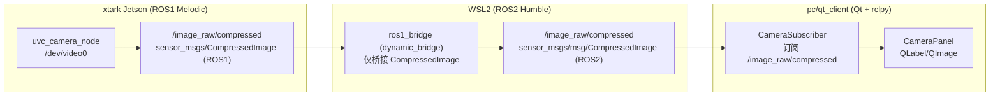

# PC 端相机显示对齐 Android 方案

最后更新：2026-06-16

目标：在 `pc/qt_client` 上实现与 Android（RobotCA）相机页**同等语义**的“看相机”能力：订阅同一类话题（`/image_raw/compressed`，`sensor_msgs/CompressedImage`），JPEG 解码显示，支持无图提示与话题配置。

本文只做方案设计与落地步骤说明，不在此文档中直接修改代码。

---

## 1. 背景与对齐点

### 1.1 Android 端相机页本质做了什么

- 订阅 **`/image_raw/compressed`**（`sensor_msgs/CompressedImage`）
- 将 JPEG 数据解码为位图并显示
- 无图时显示 “No Camera”（首帧到来后隐藏）
- 话题可配置（默认 `/image_raw/compressed`）

### 1.2 PC 端现状（`pc/qt_client`）

- 当前 `qt_client` 主要职责：GUI + TCP JSON（8765）控制底盘；同时在 WSL2 发布 ROS2（`/odom_base`、TF、`/cmd_vel` → JSON）。
- 当前未实现相机显示链路（未订阅 ROS1 `/image_raw/compressed`）。

### 1.3 核心矛盾

- 相机话题在 **xtark Jetson（ROS1 Melodic）** 上发布；
- PC/qt_client 主要在 **WSL2（ROS2 Humble）** 侧工作；
- 要对齐 Android 的话题契约，需要把 ROS1 图像以合理方式送到 qt_client。

---

## 2. 总体架构（推荐）

推荐：在 PC 侧引入桥接层，把 xtark ROS1 的 `CompressedImage` 桥接到 ROS2，然后 qt_client 只订阅 ROS2 侧话题。



关键原则：

- **对齐契约**：默认使用同名话题 `/image_raw/compressed`。
- **qt_client 只做 ROS2**：避免在同一进程混 ROS1 + ROS2。
- **桥接可独立启停**：类似现有 StackPanel 管理 slam/nav 进程的方式。

---

## 3. Bridge 层方案对比

### 3.1 方案 A（推荐）：`ros1_bridge` 桥接 `CompressedImage`

数据路径：

```text
xtark ROS1 /image_raw/compressed
  -> ros1_bridge (WSL2)
  -> ROS2 /image_raw/compressed
  -> qt_client 显示
```

优点：

- 与 Android 端完全一致的话题语义（话题名 + 消息类型）
- qt_client 保持 ROS2 纯净
- 后续可扩展（RK3568 彩色流统一进 ROS2 再显示）

注意点：

- WSL2 需能访问 `ROS_MASTER_URI=http://192.168.1.169:11311`
- `ros1_bridge` 对消息包需要双方都存在对应定义（`sensor_msgs/CompressedImage` 通常没问题）

### 3.2 方案 B（先会走）：HTTP 拉 `web_video_server`

xtark 相机栈通常会启 `web_video_server`，可用 HTTP/MJPEG 方式显示。

数据路径：

```text
xtark /dev/video0
  -> uvc_camera_node
  -> /image_raw/compressed
  -> image_transport republish
  -> /camera/image_raw
  -> web_video_server
  -> HTTP MJPEG
  -> qt_client CameraPanel
```

最小可用 URL：

```text
http://192.168.1.169:8080/stream?topic=/camera/image_raw
```

可选验证 URL：

```text
http://192.168.1.169:8080/snapshot?topic=/camera/image_raw
http://192.168.1.169:8080/stream?topic=/image_raw
```

最小验证命令：

```bash
# 机器人端
pgrep -af 'web_video_server|xtark_camera|uvc_camera'
rostopic hz /image_raw/compressed
rostopic info /camera/image_raw

# PC / WSL2 / Windows 任一能访问机器人 IP 的环境
curl -I http://192.168.1.169:8080/
curl -I "http://192.168.1.169:8080/snapshot?topic=/camera/image_raw"
```

优点：

- 实现快，不引入 `ros1_bridge`。
- 不依赖 WSL2 里同时具备 ROS1 + ROS2 环境。
- 能快速验证相机驱动、机器人端 `web_video_server`、局域网访问和 PC 端解码显示。
- 可以先把 `qt_client` 的相机 UI、无图状态、重连、FPS 显示做出来，后续只替换数据源。

缺点：

- 不再对齐 Android 的 ROS 话题模型（更难和 ROS 侧录包、诊断统一）
- 延迟、压缩格式、参数可控性不如 ROS 话题
- 只能证明“PC 能看到图”，不能证明“PC 已按 Android 的 `/image_raw/compressed` 契约接入”
- 需要处理 MJPEG 分帧、断线重连、超时无图，不应阻塞 Qt 主线程

结论：**先用它走起来**。短期作为 PC 端相机显示 MVP 和链路验证方案；长期仍回到 3.1 的 `ros1_bridge`，让 Qt 订阅 ROS2 `/image_raw/compressed`。

### 3.3 路线判断：先会走，再会跑

当前环境下，WSL2 安装和维护 `ros1_bridge` 成本较高，因此第一阶段不追求完整 ROS 语义对齐，而是优先完成“PC 端稳定看图”的用户闭环：

```text
Phase 0：HTTP/MJPEG 看图
  目标：qt_client 能显示相机、断线有提示、能配置 URL
  边界：不宣称完成 Android ROS 话题对齐

Phase 1：ros1_bridge 话题对齐
  目标：qt_client 改为订阅 ROS2 /image_raw/compressed
  边界：保留 HTTP 作为诊断入口
```

这样做的好处是：UI、状态机、无图提示、用户操作路径先稳定下来；后续换成 ROS2 订阅时，主要替换数据源，不重做界面。

---

## 4. qt_client 内部模块设计（对齐 Android 行为）

### 4.1 新增 UI：`CameraPanel`

UI 元素建议：

- `QLabel`：显示图像（Pixmap/QImage）
- 状态栏：显示 topic、FPS、是否收到首帧
- 无图提示：默认显示 “No Camera”，首帧到达隐藏

### 4.2 新增 ROS2 订阅：`CameraSubscriber`

职责对齐 Android 的 `RobotController` + `RosImageView`：

- 订阅 `sensor_msgs/msg/CompressedImage`
- 将 `data` 解析为 JPEG，解码为 `QImage`
- 用信号/主线程调度更新 UI（避免 ROS 回调线程直接改 UI）
- 超时（例如 2 秒无帧）则认为“无图”

### 4.3 配置项

使用 `QSettings` 保存：

- `camera_topic`（默认 `/image_raw/compressed`）
- 可选：显示缩放、保持宽高比、最大 FPS 等

---

## 5. 落地步骤（最短路径）

### Phase 0：先能在 PC 看图（HTTP/MJPEG 最小闭环）

1. **xtark 侧确认相机 HTTP 出口**

```bash
source /opt/ros/melodic/setup.bash
pgrep -af 'xtark_camera|uvc_camera|web_video_server'
rostopic hz /image_raw/compressed
rostopic info /camera/image_raw
```

2. **PC 侧确认浏览器/HTTP 能访问**

```bash
curl -I http://192.168.1.169:8080/
curl -I "http://192.168.1.169:8080/snapshot?topic=/camera/image_raw"
```

浏览器打开：

```text
http://192.168.1.169:8080/stream?topic=/camera/image_raw
```

3. **qt_client 新增 HTTP CameraPanel**

- 默认 URL：`http://192.168.1.169:8080/stream?topic=/camera/image_raw`
- 后台线程拉 MJPEG，不阻塞 Qt 主线程
- 解码 JPEG 帧为 `QImage` / `QPixmap`
- 首帧前显示 “No Camera”
- 2 秒无新帧显示“无图/连接中断”
- 显示 FPS、URL、连接状态
- URL 用 `QSettings` 保存

验收标准：

- 浏览器能打开 MJPEG stream。
- qt_client 能稳定显示画面。
- 拔掉网络或停掉 `web_video_server` 后，UI 不假死，并能显示无图状态。
- 恢复服务后，点击重连能继续显示。

### Phase 1：ROS 话题对齐（完整闭环）

1. **xtark 侧确认发布**

```bash
source /opt/ros/melodic/setup.bash
rostopic hz /image_raw/compressed
rostopic info /image_raw/compressed
```

2. **WSL2 启 `ros1_bridge`**

```bash
# WSL2
source /opt/ros/humble/setup.bash
export ROS_DOMAIN_ID=0

export ROS_MASTER_URI=http://192.168.1.169:11311
export ROS_IP=<wsl2可达IP或留空按现场配置>

ros2 run ros1_bridge dynamic_bridge
```

3. **qt_client 切换为 ROS2 订阅显示**

- 新增 CameraPanel + CameraSubscriber（只订阅 `/image_raw/compressed`）
- 显示首帧、FPS、无图提示

验收标准：

- `ros2 topic hz /image_raw/compressed` 有频率
- qt_client UI 能稳定显示画面
- bridge 停掉后 UI 显示无图提示

### Phase 2：体验对齐 Android

- UI 中允许配置 topic（默认不变）
- 增加桥接进程的“一键启停 + 状态显示”（可集成到现有 StackPanel）

### Phase 3（可选）：Overview 视图

- 相机小窗 + 雷达/地图（RViz2 或现有导航面板联动）
- 截图/录包（bag）能力

---

## 6. 不建议的做法

- 在 qt_client 同一进程里同时引入 ROS1 与 ROS2（维护成本高、容易踩坑）。
- 把图像塞进 JSON TCP（带宽大、延迟高、实现复杂）。
- 先从深度相机/点云链路入手（和 Android 对齐目标无关，复杂度更高）。

---

## 7. 对齐总结（一句话）

短期先用 **`web_video_server` + HTTP/MJPEG** 让 qt_client 稳定看图；长期保持 xtark 端继续发布 **ROS1 `/image_raw/compressed`**，WSL2 用 **`ros1_bridge`** 桥到 ROS2，qt_client 的 **CameraPanel** 改为订阅并解码 ROS2 `/image_raw/compressed`，从契约与行为层面对齐 Android。

---

## 8. 给实施 agent 的任务书（Phase 0）

### 背景

当前 WSL2 环境暂不优先处理 `ros1_bridge` 安装问题。机器人端 `xtark_camera.launch` 已启动 `uvc_camera_node`、`image_transport republish` 和 `web_video_server`；Android 侧已能通过 ROS `/image_raw/compressed` 看图。PC 端 `pc/qt_client` 当前还没有相机显示。

### 目标

在 `pc/qt_client` 中实现一个临时但可用的 HTTP/MJPEG 相机面板，让 PC 端先能稳定看到机器人相机画面。该实现是 Phase 0，不要求完成 ROS 话题对齐。

### 当前状态

- `pc/qt_client/app.py` 是主窗口入口。
- 现有 UI widgets 位于 `pc/qt_client/ui/widgets/`。
- 现有设置使用 `QSettings("xtark", "json_debug_client")`。
- 现有日志入口是 `MainWindow._on_log()` 和 `LogPanel`。
- 默认机器人 IP 是 `192.168.1.169`。

### 修改范围

建议新增：

- `pc/qt_client/ui/widgets/camera_panel.py`
- 必要时在 `pc/qt_client/ui/widgets/__init__.py` 导出 `CameraPanel`

建议修改：

- `pc/qt_client/app.py`
- `pc/qt_client/README.md`（补相机面板使用说明）
- `pc/qt_client/requirements.txt`（仅当选择第三方 HTTP/图像依赖时；优先使用标准库 + PyQt5）

### 实现步骤

1. 新增 `CameraPanel`，包含 URL 输入框、连接/断开/重连按钮、状态标签、FPS 标签和图像显示区域。
2. 默认 URL 使用 `http://192.168.1.169:8080/stream?topic=/camera/image_raw`。
3. 使用后台线程或 `QThread` 拉取 MJPEG stream，不能在 Qt 主线程里阻塞读取。
4. 解析 MJPEG 边界，提取 JPEG 帧；用 `QImage.fromData()` 解码。
5. 通过 Qt signal 把 `QImage`、状态、错误文本、FPS 传回主线程更新 UI。
6. 首帧前显示 `No Camera`；超过 2 秒无帧显示无图/断流状态。
7. URL 写入并读取 `QSettings`，key 建议为 `camera_http_url`。
8. 在 `MainWindow._build_ui()` 右侧状态区域或日志上方加入 `CameraPanel`，不要影响现有遥控、SLAM、导航控件。
9. 连接失败、HTTP 非 200、断流、JPEG 解码失败都要进入 UI 状态和日志，不要弹大量阻塞对话框。
10. 关闭窗口时停止相机线程，避免进程残留。

### 注意事项

- 不要在本阶段引入 ROS1 Python 依赖。
- 不要把图像塞进 JSON TCP 8765。
- 不要改机器人端 launch。
- 不要把 HTTP 方案描述成最终对齐 Android；它只是先看图。
- 不要让相机线程影响底盘控制发送频率。
- 如果 `/camera/image_raw` 不通，可手动试 `/image_raw`，但默认仍优先 `/camera/image_raw`。

### 验收标准

- 打开 `./run.sh --no-ros` 也能使用相机面板。
- 输入默认 URL 后能显示机器人相机画面。
- 图像区域保持宽高比，不撑坏窗口布局。
- 停掉机器人端 `web_video_server` 后，UI 能在 2 秒左右显示无图状态。
- 恢复服务后，点击重连能恢复画面。
- 关闭 qt_client 后无相机读取线程残留。
- 现有 JSON 连接、遥控、SLAM/Nav 控件不回归。

### 不要做什么

- 不要在 Phase 0 安装或修 `ros1_bridge`。
- 不要实现录像、截图、OpenCV 处理。
- 不要把深度相机 `/camera/depth/*` 纳入本阶段。
- 不要重构主窗口布局或搬动已有控制逻辑。
- 不要提交机器人端密码、SSH 命令中的明文密码或本地机器私有路径到文档外的新代码注释中。

---

## 附：迁移/学习路线（原文拷贝）

可以把它当成“把一套相机数据流搬进你自己的机器人项目”的学习/迁移路径。按 Xtark 这套经验，建议按 **从底到上** 的顺序学，先跑通数据，再谈算法/APP。

---

## 0. 先搞清楚你要迁移的是哪条“相机通路”
Xtark 里其实是两条：

- **UVC 彩色通路**：`/dev/video0` → UVC 驱动 → ROS 图像话题（Android 用的就是这条）
- **深度通路（Astra/OpenNI2）**：深度/RGB/点云 → ROS 话题（导航/RTAB 用）

迁移时先选一条，否则会越学越乱。

---

## 1. 第一步：只做“驱动层”，让新设备稳定出图
### ROS1（类比 Xtark）
- **UVC 彩色**：优先学 `camera_umd/uvc_camera` 这种通用驱动（Xtark 当前实机就是它）
- **深度 Astra**：学 `ros_astra_camera`（Orbbec 驱动）

目标结果（最重要）：
- `rostopic list` 能看到 `*/image_raw` 或 `*/compressed`
- `rqt_image_view` 能稳定看到画面
- 帧率/分辨率/设备号可控（`/dev/videoX`、fps、width/height）

### ROS2（对应迁移）
- 找 ROS2 等价驱动（UVC 一般用 `v4l2_camera` 或厂商 ROS2 驱动；Astra 用 ROS2 astra 驱动/SDK）
- 目标结果同上：`ros2 topic list` + `rqt_image_view` + 帧率稳定

---

## 2. 第二步：把“话题约定”统一（这是最省心的一步）
Xtark 的 Android 约定是：
- **Android 订阅**：`/image_raw/compressed`（`sensor_msgs/CompressedImage`）

所以迁移到你自己的项目时，最好做到：
- 不管底层驱动输出什么（`/camera/image_raw`、`/cam0/image_raw`），都 **re-map / republish** 成你项目统一的 topic（比如也叫 `/image_raw/compressed`）
- ROS1 用 `image_transport republish` 或驱动直接发 compressed
- ROS2 用 image_transport/组件或节点参数实现同样效果

目标结果：
- 你上层（算法/APP/桥接）永远只认一个 topic 名

---

## 3. 第三步：再做“二次封装 launch/参数/标定”
这层就是 Xtark 的 `xtark_driver` 风格：
- 分辨率档位（480p/720p/1080p）
- `camera_info_url` 标定文件
- 一键 launch（把驱动、压缩、web 预览串起来）
- 失败时的自检（设备不存在就跳过）

目标结果：
- 一条 launch 命令就把相机带起来，别人不需要懂驱动细节

---

## 4. 第四步：把相机接到“你的上层系统”
按你要用到哪里来分：

- **只给 UI/Android/远程看图**：只要 `CompressedImage` + 话题约定就够了
- **接视觉算法（YOLO/跟踪/巡线）**：再学 `cv_bridge`/OpenCV 节点、同步时间戳、坐标系
- **接导航/SLAM（RGB-D / 点云）**：再学 TF、depth→pointcloud、同步、以及你选的 SLAM 栈

---

## 5. 建议的最短学习路线（像 Xtark 一样快出结果）
1) 在新设备上把 **UVC** 跑通（最简单、最像 Android 主链路）
2) 用 republish 把输出统一成 `/image_raw/compressed`
3) 用 `rqt_image_view` + `rostopic hz` 验证稳定性
4) 再考虑深度相机/点云/算法

---

## 你本地这份资料怎么用最有效
`机器人工作空间源码/MEC源码V2.0.zip` 适合当“教材”看结构：
- `xtark_driver`：如何封装 launch + 标定
- `third_packages/*`：有哪些驱动/示例可参考
但真正迁移请以 **你当前机器上的 ros_ws（你已备份）** 为准，因为它更接近现实运行栈（比如相机已经从 `cv_camera` 演进到 `uvc_camera`）。

---

如果你告诉我：**目标设备是什么（Linux 还是 Android/盒子）、相机型号（UVC 还是 Orbbec 深度）、你最终要 ROS1 还是 ROS2**，我可以把上面步骤缩成一条具体的“按命令走”的路径（每一步用哪个包、跑哪些命令、预期看到什么 topic）。

