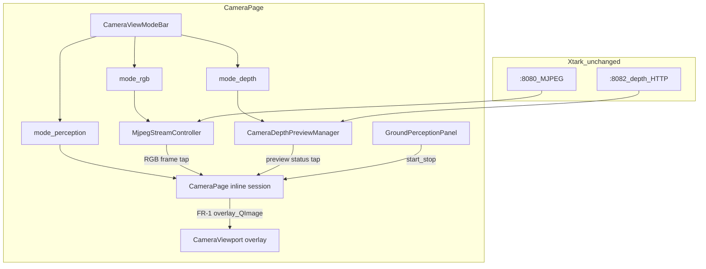
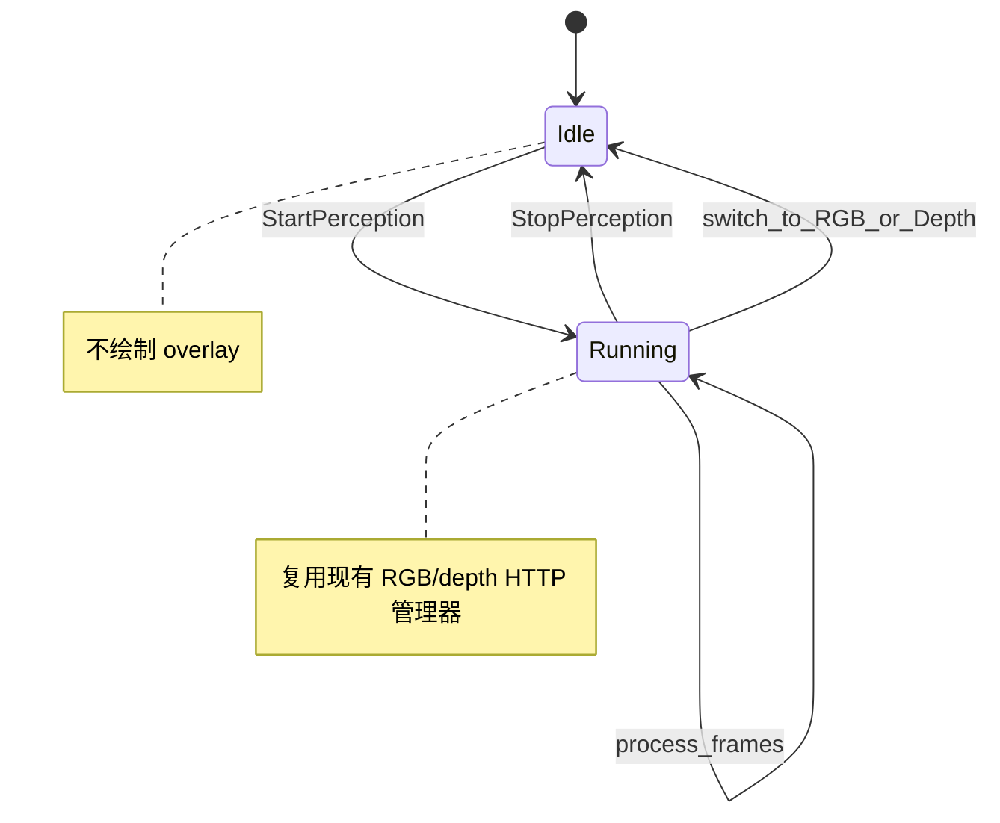

# 地面感知（摄像头页内）— 整体方案

最后更新：2026-06-27

目标：在 `pc/qt_client` **摄像头页**内新增 **「感知」视图模式**，按需启动地面走廊可视化（灯带 / 走廊内障碍 / 楼梯棱线）。**不动 xtark**；**不新增侧栏**；RGB/Depth 现有模式行为不变。

---

## 1. 目标与边界

### 1.1 产品目标

| ID | 能力 | 参数 | 可视化 |
|----|------|------|--------|
| FR-1 | 地面「灯带」 | 车体宽 **a** | 半透明梯形/扇形，沿地面向前 |
| FR-2 | 走廊内障碍 | 前向距离 **b** | 仅灯带投影区域内标注框/轮廓 |
| FR-3 | 楼梯棱线 | 有效距离 **c** | 台阶前沿水平线段（类似实测图蓝线） |

### 1.2 硬约束

| 编号 | 约束 |
|------|------|
| C1 | **不动小车端**：只用 `http://{host}:8080` RGB MJPEG、`http://{host}:8082` depth raw + `camera_info` |
| C2 | **摄像头页内实现**：不新增侧栏；在 `CameraPage` 增加 **「感知」**视图；RGB/Depth 模式不改 |
| C3 | **视图即会话**：切到「感知」自动开始 overlay；切回 RGB/Depth 自动停止感知计算 |

### 1.3 明确不做

- 不改 xtark launch/脚本/HTTP 协议
- 不改导航 / costmap / `move_base` / JSON `:8765`
- 不在 RGB/Depth 视图上叠 overlay
- 不新增 `GroundPerceptionPage`、不改 `robot_side_nav.py`
- 不采用 MEC `depthimage_to_laserscan` 作为摄像头页主输入（与 Phase 2.0 文档边界一致）

---

## 2. 需求规范化（PRD）

### 2.1 输入数据

| 输入 | 来源 | 用途 |
|------|------|------|
| RGB 帧 | `:8080` MJPEG `/camera/image_raw` | 感知模式 2D 画布 |
| Depth raw | `:8082` `/v1/depth/latest` | 距离、高度差、障碍/楼梯几何 |
| Depth camera_info | `:8082` `/v1/depth/camera_info` | 深度反投影（K 矩阵） |
| 车体宽 **a** | `.env` | 地面走廊宽度 |
| 相机外参 | `.env` + `robot_frames.py` 默认 | depth/base 几何变换 |

**生效范围**：仅当 `CameraPage.view_mode == "perception"` 且 **感知会话 Running**。

所有结果 **仅用于摄像头页可视化与诊断**，不接入导航主链路（对齐 `PC端摄像头模块与ROS2视觉演进方案.md` Phase 2.0）。

### 2.2 FR-1 地面灯带（Headlight Corridor）

- **参数 a**：车体有效通行宽度（米），默认 **0.24**（MEC demo footprint ±0.12m）。
- **行为**：在 2D 预览上绘制沿地面向前的 **半透明梯形灯带**，左右边界对应 `base_link` 下 `y ∈ [-a/2, +a/2]`。
- **可视距离**：至少 `max(b, c)`，上限可配置（如 5m）。
- **配置**：`GROUND_CORRIDOR_WIDTH_M`、`GROUND_OVERLAY_MAX_RANGE_M`。

### 2.3 FR-2 走廊内障碍标注

- **参数 b**：前向检测距离（米），默认 **2.0**。
- **ROI**：`0 < x ≤ b`，`|y| ≤ a/2`（base_link 地面系）。
- **障碍定义**：相对地面高度超过障碍阈值的有效 depth 点；该阈值属于后续障碍识别实现项，当前不放入 `.env`。
- **过滤**：仅标注 **投影后与灯带 polygon 相交** 的聚类；灯带外 **不画**。
- **输出**：2D 包围框 + 可选最近障碍距离。

### 2.4 FR-3 楼梯棱线标注

- **参数 c**：有效距离（米），默认 **2.5**。
- **ROI**：`|y| ≤ a/2`，`0 < x ≤ c`。
- **定义**：检测 **近似水平、深度阶跃** 的台阶前沿（连续 1~N 条线段）。
- **算法参考**：`plj/src/slam_perception/slam_perception/stair_detector_node.py`（x 分 bin + 台阶高度差 + 时序确认），输入改为 depth ROI；MEC `xtark_hough_lines` 仅辅助画线，不能单独承担检测。

### 2.5 非功能需求

- FR-2/FR-3 算法在 **QThread** 运行，不阻塞 Qt 主线程。
- RGB 与 depth **尽力同步**（时间戳差 >200ms 可跳过本帧 overlay，Phase 2 起生效）。
- 感知会话 **复用** 摄像头页已有 HTTP 连接，不建第二套 `:8082` 拉流。

---

## 3. 总体架构



### 3.1 视图模式（`CameraViewModeBar`）

| 模式 | 按钮 | 行为 |
|------|------|------|
| `rgb` | RGB | **不变**：MJPEG 单预览 |
| `depth` | Depth | **不变**：depth HTTP 伪彩 |
| `perception` | 感知 | **新增**：单 2D overlay 预览 + 右栏感知控件 |

按钮顺序：`RGB | Depth | 感知`。

### 3.2 感知会话状态机



**Running**（切到感知视图自动开始）：

1. 若未连接：复用 `_on_connect` 拉起 `:8080` + `:8082`（一套连接）
2. 从 `MjpegStreamController` tap 最新 RGB 帧；depth preview 仅作为连接状态与后续算法输入准备
3. `GroundPerceptionOverlay` 绘制 FR-1 灯带 → `CameraViewport`

**切离感知视图**：

- `_ground_running=False`：停止 overlay 绘制；Phase 2 后再停止 Worker / raw-depth tap
- **不断开** toolbar 相机连接；切回 RGB/Depth 恢复原有 `_on_view_mode_changed` 逻辑

### 3.3 与 RGB/Depth 资源互斥

进入 **感知** 视图：

- `_stream.pause()`：不向 RGB viewport 推帧
- `_depth_preview.pause()` UI delivery；底层 HTTP 保持供 tap

切回 **RGB/Depth**：

- `session.stop()` 优先
- 恢复 stream / depth preview

---

## 4. UI 布局

```
┌─ CameraToolbar（连接/URL，不变）────────────────────────┐
├─ [RGB] [Depth] [感知]  ← CameraViewModeBar               │
├──────────────────────────────┬───────────────────────────┤
│  主预览区                     │ 右栏                       │
│  rgb/depth: CameraViewport   │ rgb/depth: CameraDepthPanel│
│  perception: overlay 单预览   │ perception:                │
│                              │   GroundPerceptionPanel    │
├─ CameraRos2Panel（感知模式可折叠）─────────────────────────┤
├─ TelemetryDetailsStrip + ManualControlStrip（不变）──────┤
└───────────────────────────────────────────────────────────┘
```

**GroundPerceptionPanel**：

- 状态：Idle / Running
- 只读：a、b、c
- 摘要：最近障碍、楼梯有/无、有效像素%、FPS、标定状态（近似/已配置）

---

## 5. 核心模块

| 模块 | 路径 | 职责 |
|------|------|------|
| `GroundPerceptionConfig` | `core/camera_ground_config.py` | 读 `.env` a/b/c、外参 |
| `GroundPerceptionGeometry` | `core/camera_ground_geometry.py` | 走廊 3D→像素；depth 反投影 |
| `GroundPerceptionEngine` | `core/camera_ground_perception.py`（Phase 2） | 障碍聚类、楼梯棱线（纯函数） |
| `GroundPerceptionOverlay` | `core/camera_ground_overlay.py` | polygon/line/bbox → QImage |
| `GroundPerceptionWorker` | `core/ground_perception_worker.py`（Phase 2） | QThread 合帧与 emit |
| `GroundPerceptionPanel` | `ui/widgets/ground_perception_panel.py` | 右栏控件 |
| `GroundPerceptionViewport` | `ui/widgets/ground_perception_viewport.py` | 或扩展 `camera_viewport.py` |

---

## 6. 算法要点

### 6.1 灯带（FR-1）

> ✅ **算法验证**：投影公式与 ROS `depthimage_to_laserscan` 官方实现完全一致

1. 在 `base_link` 地面（z=0）沿 +x 采样 `d = 0..max_range`。
2. 每 d 取 `(d, ±a/2, 0)`，经外参到 camera 系，用 camera_info.K 投影到像素。
   - **核心公式**（参考 `DepthImageToLaserScan.h:198-199`）：
     ```
     constant_x = 1.0 / fx
     pixel_x = cx + (X / Z) * fx
     pixel_y = cy + (Y / Z) * fy
     ```
3. 连接成梯形 polygon，半透明填充。

### 6.2 障碍（FR-2）

> ✅ **算法验证**：深度反投影逻辑与 ROS 官方实现一致

1. depth 有效像素 → 3D → `base_link`。
   - **反投影公式**（参考 `DepthImageToLaserScan.h:198-199`）：
     ```
     Z = depth_value * scale_factor  # uint16_t 则 ×0.001
     X = (u - cx) * Z / fx
     Y = (v - cy) * Z / fy
     ```
2. 筛选 ROI 内且 `z > h_min` 的点 → 聚类。
3. 保留与灯带 polygon 相交的簇 → 投影画框。

### 6.3 楼梯棱线（FR-3）

1. ROI 内按 x 分 bin（参考 `stair_detector`）。
2. 检测台阶高度 ∈ `[0.05, 0.25]m` 的阶跃。
3. 时序确认（`confirm_frames`）→ 拟合水平线段 → 画棱线。

---

## 7. MEC demo 复用关系

| Demo | 用途 | 是否在小车端运行 | 参考文件 |
|------|------|------------------|----------|
| `xtark_nav_depthcamera` costmap footprint | 默认 a=0.24 | 否 | `xtark_nav_depthcamera/config/diff/costmap_common_params.yaml` |
| `depthimage_to_laserscan` | **深度反投影公式参考**（核心算法） | 否，PC 移植逻辑 | `third_packages/depthimage_to_laserscan/src/DepthImageToLaserScan.cpp` |
| Astra Pro 标定内参 | fx/fy/cx/cy 真实数值 | 否 | `xtark_nav_depthcamera/config/depth_cam.yaml` |
| `plj/stair_detector` | 楼梯分 bin 算法模板 | 否，PC 迁移 | - |
| `xtark_cv/hough_lines` | 可选画线风格 | 否 | - |
| `rgbd_launch/depth_registered` | 配准思路参考；**本方案 C1 不在小车启用** | 否 | - |

> **参考来源说明**：以上源码均来自 `ROS功能包源码/机器人工作空间源码/MEC源码V2.0/` 目录

### 7.1 不动小车端的代价

Astra Pro RGB（UVC）与 depth（OpenNI）**未像素配准**。PC 侧用：

- depth `camera_info` 做 3D
- `.env` RGB 内参近似 + homography / 外参 pitch 标定

灯带/框/线可能有 **系统性偏移**；感知面板需提示「标定状态」。

---

## 8. 配置（`.env`）

写入个人开发配置 `pc/qt_client/.env`（`os.environ` 直读，与 `DepthSourceConfig` 一致）。本仓库不再维护 `.env.example`：

```bash
# 摄像头页 · 地面感知
# 当前只做走廊黄线 overlay；障碍物/楼梯识别尚未接入，不在 .env 放预留阈值。
GROUND_OVERLAY_ENABLE=1
GROUND_OVERLAY_METHOD=trapezoid        # trapezoid 临时显示；geometric 依赖相机标定
GROUND_TRAPEZOID_BOTTOM_Y_RATIO=0.02   # 仅 trapezoid 生效
GROUND_TRAPEZOID_TOP_Y_RATIO=0.4       # 仅 trapezoid 生效
GROUND_TRAPEZOID_TOP_WIDTH_RATIO=0.4   # 仅 trapezoid 生效

GROUND_CORRIDOR_WIDTH_M=0.24           # 黄线真实走廊宽度 a
GROUND_OBSTACLE_RANGE_M=2.0            # 后续障碍距离 b；当前用于显示/ROI
GROUND_STAIR_RANGE_M=2.5               # 后续楼梯距离 c；当前用于显示/ROI
GROUND_OVERLAY_MAX_RANGE_M=5.0         # 黄线最大投影距离
GROUND_PERCEPTION_MAX_FPS=5            # 感知绘制/计算帧率上限

# 深度相机内参：geometric 模式和 depth 反投影使用。
# 来源：xtark_nav_depthcamera/config/depth_cam.yaml
DEPTH_FX=578.579084625938
DEPTH_FY=579.3575953496057
DEPTH_CX=679.1573216382707
DEPTH_CY=323.1467217747702

# base_link -> camera_link 外参：geometric 模式使用，未实机标定前只能算初值。
CAMERA_X=0.10                          # 向前为正，单位 m
CAMERA_Y=0.0                           # 向左为正，单位 m
CAMERA_Z=0.20                          # 向上为正，单位 m
CAMERA_PITCH=0.35                      # 相机向下俯仰为正，单位 rad

# 可选：RGB 内参近似（不动小车时 overlay 投影用）
# RGB_FX=... RGB_FY=... RGB_CX=... RGB_CY=...
```

---

## 9. 分阶段交付

### Phase 1 — 感知视图 + 灯带

- `CameraViewModeBar` 增「感知」
- `CameraPage` 模式切换 + `GroundPerceptionPanel`
- `CameraPage` 内联 start/stop 状态
- RGB 帧 tap + FR-1 灯带 overlay

### Phase 2 — 障碍（FR-2）

- 走廊内障碍检测与框标注
- 摘要：最近障碍距离
- 引入 raw depth 数据 tap、`GroundPerceptionEngine` 与 `GroundPerceptionWorker`

### Phase 3 — 楼梯棱线（FR-3）

- 迁移 stair_detector 分 bin 逻辑
- 棱线绘制 + 防抖

### Phase 4 — 可选 3D + 文档

- `config/xtark_ground_perception.rviz`
- 会话内可选 `/camera/perception/markers`
- 更新 `PC端摄像头模块与ROS2视觉演进方案.md` 新节

---

## 10. 验收标准

| 项 | 条件 |
|----|------|
| C1 | xtark 仓库 diff 为空 |
| C2 | RGB/Depth 模式与改前一致（无 overlay、无感知 Worker） |
| C2b | 无新侧栏；入口仅摄像头页「感知」按钮 |
| C3 | 未点开始不绘制 overlay；停止或切模式后回到 Idle |
| FR-1 | 灯带宽度与 a 一致，延伸至 max(b,c) |
| FR-2 | 灯带内障碍有框，灯带外不标 |
| FR-3 | c 内楼梯棱线稳定更新 |
| 稳定性 | 停止/重开 10 次无泄漏 |

---

## 11. 风险与缓解

| 风险 | 影响范围 | 缓解 | 参考来源 |
|---|---|---|---|
| RGB-depth 不对齐 | 三个功能都偏移 | `.env` 标定；面板显示「标定状态」 | `depth_cam.yaml` 只有深度内参 |
| 地面反光 depth 空洞 | 障碍/楼梯漏检 | 显示「有效像素%」；空洞大时降置信度 | `DepthTraits::valid()` 有效性判断逻辑 |
| 切模式闪烁 | 用户体验 | tap 不断 HTTP，仅暂停 UI delivery | 现有 Manager pause/resume 设计 |
| 计算耗时高 | FPS 低 | 限制 5fps；QThread 后台跑；ROI 裁剪 | `scan_height` 垂直压缩思想 |
| RViz WSL 性能 | 3D 显示 | 默认关 3D；`XTARK_RVIZ_SOFTWARE_GL` | 现有环境变量机制 |

---

## 12. 文件变更清单

**新建**

- `pc/qt_client/core/camera_ground_config.py`
- `pc/qt_client/core/camera_ground_geometry.py`
- `pc/qt_client/core/camera_ground_overlay.py`
- `pc/qt_client/core/camera_ground_trapezoid.py`
- `pc/qt_client/ui/widgets/ground_perception_panel.py`
- `pc/qt_client/config/xtark_ground_perception.rviz`（Phase 4）

**修改**

- `pc/qt_client/ui/pages/camera_page.py`
- `pc/qt_client/ui/widgets/camera_view_mode_bar.py`
- `pc/qt_client/ui/widgets/camera_viewport.py`（若需第四布局）
- `pc/qt_client/.env`（个人开发配置，不提交模板）
- `pc/docs/PC端摄像头模块与ROS2视觉演进方案.md`（Phase 4 交叉引用）

**不修改**

- `pc/qt_client/ui/widgets/robot_side_nav.py`
- `pc/qt_client/ui/pages/robot_workspace_page.py`
- `xtark/**`

---

## 13. 参考资料清单

### ROS 官方包参考
| 包名 | 文件 | 用途 |
|------|------|------|
| `depthimage_to_laserscan` | `DepthImageToLaserScan.h:169-211` | 深度反投影核心算法（已验证公式一致） |
| `depthimage_to_laserscan` | `depth_traits.h` | uint16/float 深度值转换规则 |
| `image_geometry` | `PinholeCameraModel` | 相机投影/反投影数学模型 |

### MEC 源码参考
| 路径 | 文件 | 用途 |
|------|------|------|
| `xtark_nav_depthcamera/config/` | `depth_cam.yaml` | Astra Pro 真实标定内参（fx/fy/cx/cy） |
| `xtark_nav_depthcamera/config/diff/` | `costmap_common_params.yaml` | 车体 footprint 尺寸（0.24m 宽）、obstacle_range=2.0m |
| `xtark_cv/xtark_line_follower/src/` | `detect.cpp` | OpenCV + ROS 图像处理范式 |

### 不动小车端的代价说明（补充）

Astra Pro RGB（UVC）与 depth（OpenNI）**未像素配准**。PC 侧用：

- depth `camera_info` 做 3D → 灯带/障碍/楼梯的 3D 计算用深度相机坐标系
- RGB 帧做背景 → overlay 像素坐标直接用 RGB 像素系

**偏移处理**：
1. 灯带 polygon 用深度相机内参投影后，通过 Homography 映射到 RGB 像素（ `.env` 可配偏移）
2. 感知面板显示「标定状态」提示用户
3. 实际使用中，灯带只要「相对位置正确」即可，绝对像素偏移可接受

---

## 14. 实施 Todo

- [x] Phase1: CameraViewModeBar 增「感知」+ 视图自动 start/stop
- [x] Phase1: RGB 帧 tap + FR-1 灯带
- [ ] Phase2: FR-2 障碍 + 摘要面板
- [ ] Phase3: FR-3 楼梯棱线
- [ ] Phase4: 可选 RViz2 + markers + 文档
