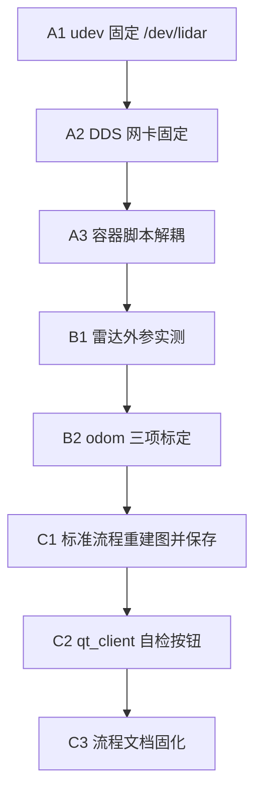

## 3. 当前已经跑通的内容

### 3.1 RK3568 雷达链路已恢复

插拔 USB 后，雷达串口号发生漂移，最初配置指向：

```text
LIDAR_SERIAL=/host_dev/ttyUSB0
```

但现场一度只出现：

```text
/dev/ttyUSB1
/dev/ttyUSB2
```

错误串口会导致 `sllidar_node` 进程存在，但没有实际 scan 数据。典型错误：

```text
SL_RESULT_OPERATION_TIMEOUT
```

重新确认后，当前可用雷达口是：

```text
LIDAR_SERIAL=/host_dev/ttyUSB0
```

雷达日志已正常显示：

```text
SLLidar S/N
Firmware Ver: 1.29
Hardware Rev: 7
SLLidar health status : OK
scan frequency: 10.0 Hz
```

WSL2 侧也已经能收到 `/scan`，频率约 14 Hz。

### 3.2 xtark 底盘链路正常

xtark 上已确认：

```text
bringup running
json adapter running
8765 listening
```

WSL2 可以直接收到 xtark JSON 里程计数据。

qt_client 连接 xtark 后，WSL2 中出现：

```text
/odom
/odom_base
/base_status
/tf
/tf_static
```

`/odom` 频率约 11 Hz。

### 3.3 TF 链路成立

当前 TF 链路为：

```text
odom -> base_link
base_link -> laser
```

其中：

```text
odom -> base_link
```

由 xtark 里程计经 qt_client 发布。

```text
base_link -> laser
```

由 qt_client 发布静态 TF。

当前 `base_link -> laser` 仍是占位外参：

```text
x = 0.0
y = 0.0
z = 0.15
yaw = 0.0
```

这能让 SLAM 跑起来，但不代表外参已经精确。

### 3.4 SLAM 已经生成地图

已经启动：

```text
slam_toolbox
rviz2
qt_client
```

RViz 中 `/map` 状态为 OK。

当前地图参数：

```text
Topic: /map
Type: nav_msgs/msg/OccupancyGrid
Resolution: 0.05
Width: 208
Height: 202
Frame: map
```

地图统计：

```text
total cells: 42016
unknown: 35645
free: 5830
occupied: 541
known ratio: 15.2%
occupied ratio: 1.3%
```

这说明地图不是空图，SLAM 确实在消费雷达和里程计数据。

## 4. 当前地图质量判断

当前地图可以证明系统链路已经跑通：

```text
雷达数据 -> WSL2
底盘 odom -> qt_client -> ROS2
TF 完整
SLAM 输出 /map
RViz 可显示地图
```

但是当前地图还不适合作为最终导航地图。

从 RViz 观察，地图中已经有墙体和障碍轮廓，但同时存在：

```text
放射状碎线
散点
局部拖影
墙线不够干净
```

这些现象说明目前是“初步可建图”，不是“高质量可导航地图”。

## 5. 遇到的问题

### 5.1 USB 串口号漂移

问题表现：

```text
雷达启动配置指向 ttyUSB0
实际设备变成 ttyUSB1 / ttyUSB2
sllidar_node 进程存在但 /scan 没数据
```

影响：

```text
SLAM 无法生成 /map
地图保存失败，提示没有收到 /map
```

临时解决：

```text
确认实际可用串口
更新 sensor_stack/.env 中的 LIDAR_SERIAL
重启传感器容器
```

长期解决：

需要在 RK3568 上配置 udev 规则，把雷达固定成：

```text
/dev/lidar
```

然后配置：

```text
LIDAR_SERIAL=/host_dev/lidar
```

这样以后 USB 插拔后不再依赖 `ttyUSB0/1/2`。

### 5.2 Docker Compose 操作曾出现卡顿

在切换雷达串口并重启容器时，`docker compose up/down` 曾出现卡住或容器处于：

```text
Removal In Progress
Created
Restarting
```

原因判断：

```text
容器内 start_sensors.sh 采用 wait -n
任意子进程退出会导致整个容器退出
错误串口会让 sllidar_node 退出
容器 restart 策略触发重启循环
```

短期处理方式：

```text
停止卡住的 docker compose 客户端进程
删除异常容器
使用正确 LIDAR_SERIAL 重新启动容器
```

后续建议：

优化 `start_sensors.sh`，不要因为雷达单独失败就反复重启整个相机/雷达容器；可以将雷达和相机拆成两个服务，或者给雷达增加更清晰的失败状态和重试逻辑。

### 5.3 WSL2 与 RK3568 的 ROS2 数据发现/接收问题

曾经出现：

```text
WSL2 能看到 /scan topic
但 ros2 topic echo /scan 收不到数据
```

后来恢复后，WSL2 可收到 `/scan` 约 14 Hz。

判断：

```text
这类问题通常和 ROS2 DDS 网络接口选择有关
WSL2 同时存在 198.18.x.x 和 192.168.1.x 网卡
DDS 发现和数据传输可能走错接口
```

后续建议：

固定 ROS2 DDS 网络配置。可选方向：

```text
CycloneDDS 固定网卡
FastDDS interface whitelist
统一 ROS_DOMAIN_ID
检查 ROS_LOCALHOST_ONLY 是否为 0
```

### 5.4 雷达外参仍是占位

当前 `base_link -> laser` 静态 TF 只是为了让系统跑通：

```text
x = 0.0
y = 0.0
z = 0.15
yaw = 0.0
```

如果雷达实际安装位置和朝向不是这个值，会导致：

```text
墙线偏移
地图拖影
转弯时图像变厚
闭环不稳定
导航定位误差
```

后续需要测量并修正：

```text
laser 相对 base_link 的 x
laser 相对 base_link 的 y
laser 高度 z
laser yaw 方向
```

### 5.5 odom 横移/转向可能需要校准

小车前进和左右移动后，odom 中 `y` 方向变化较明显。

这可能是正常的麦轮横移累计，也可能说明：

```text
底盘 odom 坐标方向需要确认
麦轮横移里程计误差较大
转向和横移耦合
```

后续需要做简单标定：

```text
直行 1 米，看 odom x 是否接近 1 米
横移 0.5 米，看 odom y 是否接近 0.5 米
原地旋转 90 度，看 yaw 是否接近 90 度
```

### 5.6 地图质量问题

当前地图可以证明链路成立，但 RViz 中仍存在：

```text
放射状碎线
散点
局部拖影
墙线不够干净
```

当前统计（`known ratio: 15.2%`）说明是「初步可建图」，不宜直接作为最终导航地图。根因与 5.4 外参占位、5.5 odom 未标定、建图运动方式有关，需在标定完成后再重建图。

### 5.7 问题一览

| 编号 | 问题 | 表现 | 当前状态 |
|------|------|------|----------|
| 5.1 | USB 串口号漂移 | 配置 `ttyUSB0`，实际变成 `ttyUSB1/2`；进程在跑但无 `/scan` | 临时改 `.env` 已恢复，未做长期固定 |
| 5.2 | Docker Compose 卡顿/重启循环 | `Removal In Progress`、`Restarting`；`wait -n` 导致雷达一挂整容器退出 | 手动清理后可用，脚本未改 |
| 5.3 | WSL2 ↔ RK3568 DDS 不稳定 | 能看到 `/scan` topic 但 `echo` 无数据；多网卡走错接口 | 已恢复约 14 Hz，配置未固化 |
| 5.4 | 雷达外参占位 | `base_link→laser` 为 `x=0,y=0,z=0.15,yaw=0` | 能建图，墙线偏移/拖影/闭环差 |
| 5.5 | odom 横移/转向未标定 | 前进/横移后 `y` 变化明显 | 未做定量标定 |
| 5.6 | 地图质量偏低 | 碎线、散点、拖影；`known ratio` 仅 15.2% | 链路成立，不宜直接用于导航 |
| — | 历史：保存地图失败 | `没有收到 /map`（上游 `/scan`/odom/TF 缺失） | 前提已满足，可尝试保存 |

## 6. 为什么之前保存地图失败

之前保存地图失败提示：

```text
没有收到 /map 消息
```

直接原因：

```text
map_saver_cli 没有收到 /map
```

上游原因：

```text
SLAM 没有成功生成地图
```

再上游原因包括：

```text
RK 雷达串口错误，/scan 无真实数据
qt_client 未连接，/odom 和 TF 缺失
GUI/SLAM 旧进程残留造成状态混乱
```

当前这些条件已经改善：

```text
/scan 有数据
/odom 有数据
TF 完整
/map 已生成
```

因此现在具备保存地图的前提。

## 7. 当前建议操作流程

### 建图前检查

WSL2 中确认：

```bash
source /opt/ros/humble/setup.bash
export ROS_DOMAIN_ID=0

ros2 topic hz /scan
ros2 topic hz /odom
ros2 topic echo /tf_static --once
ros2 run tf2_ros tf2_echo odom base_link
```

期望：

```text
/scan 约 14 Hz
/odom 约 10 Hz
base_link -> laser 存在
odom -> base_link 存在
```

### 建图操作

1. 启动 qt_client 并连接 xtark。
2. 启动 SLAM。
3. 启动 RViz。
4. 小车静止 5-10 秒，等待 `/map` 出现。
5. 低速移动。

建议运动方式：

```text
速度 0.05 - 0.10 m/s
少横移
少原地急转
多走大弧线
沿墙或边界走
每走一段停 2-3 秒
尽量重复观察已经扫过的边界
```

### 保存地图

当 RViz 中地图边界稳定、墙线不继续明显漂移时，再保存地图。

保存前确认：

```bash
ros2 topic echo /map --once
```

如果能收到 `/map`，再执行保存。

## 8. 下一步优化步骤

建议分三阶段推进：**先稳住链路 → 再标定精度 → 最后提升地图与工具化**。

最短执行路径：

```text
A1 udev 固定 → A2 DDS 网卡固定 → B1 雷达外参 → B2 odom 标定 → C1 重建图保存
```



### 阶段 A：稳定性（阻塞项，先做）

#### A1. RK3568 雷达 udev 固定设备名

目标：插拔 USB 后不再依赖 `ttyUSB0/1/2`。

1. 在 RK3568 上查雷达 `idVendor` / `idProduct`：

```bash
udevadm info -a -n /dev/ttyUSB0 | grep -E 'idVendor|idProduct|serial'
```

2. 写 udev 规则，例如 `/etc/udev/rules.d/99-lidar.rules`：

```text
SUBSYSTEM=="tty", ATTRS{idVendor}=="xxxx", ATTRS{idProduct}=="xxxx", SYMLINK+="lidar"
```

3. 执行 `udevadm control --reload && udevadm trigger`，确认出现 `/dev/lidar`。
4. 更新 `sensor_stack/.env`：`LIDAR_SERIAL=/host_dev/lidar`，重启传感器容器。
5. 验收：故意拔插 USB，`/scan` 仍约 10–14 Hz，无需改配置。

#### A2. 固定 WSL2 / RK3568 的 ROS2 DDS 网络

目标：避免 `/scan` 时通时不通。

1. 统一环境变量（WSL2 与 RK3568 一致）：

```bash
export ROS_DOMAIN_ID=0
export ROS_LOCALHOST_ONLY=0
```

2. 选定 DDS 实现并固定网卡（优先 `192.168.1.x` 局域网口）：
   - **CycloneDDS**：`CYCLONEDDS_URI` 指定 `<NetworkInterfaceAddress>192.168.1.x</NetworkInterfaceAddress>`
   - **FastDDS**：`FASTRTPS_DEFAULT_PROFILES_FILE` 配置 interface whitelist
3. 写入 `~/.bashrc` 或 qt_client 启动脚本，避免每次手动 export。
4. 验收：重启 WSL2 / qt_client 后，连续 10 分钟执行 `ros2 topic hz /scan` 和 `ros2 topic hz /odom`，频率稳定、无长时间 0 Hz。

#### A3. 优化 RK 传感器容器启动脚本

目标：雷达失败不拖垮整容器、不进入重启死循环。

1. 改 `start_sensors.sh`：雷达与相机解耦（拆成两个 compose service，或去掉 `wait -n` 全容器退出逻辑）。
2. 雷达串口错误时：记录明确日志 + 有限重试，而不是立刻让容器 exit → restart 循环。
3. 验收：故意配错串口时，容器状态为 `Exited` 或雷达服务 `unhealthy`，而不是 `Restarting` 卡死；修正后 `docker compose up` 一次成功。

### 阶段 B：标定（直接影响地图质量）

#### B1. 测量并修正 `base_link -> laser` 外参

目标：减少墙线偏移、拖影、转弯变厚。

1. 用卷尺/CAD 量：雷达相对底盘中心（`base_link`）的 `x, y, z` 及安装 yaw。
2. 在 qt_client 中更新静态 TF 发布参数（当前占位见 5.4）。
3. 验收：
   - 小车贴墙慢速直行，RViz 中墙线应更直、重复扫过不增厚；
   - `ros2 run tf2_ros tf2_echo base_link laser` 与实测一致。

#### B2. 底盘 odom 标定

目标：确认直行/横移/旋转比例与坐标方向。

| 动作 | 期望 odom 变化 | 容差建议 |
|------|----------------|----------|
| 直行 1 m | `x ≈ 1.0` | ±5% |
| 横移 0.5 m | `y ≈ 0.5` | ±10%（麦轮可放宽） |
| 原地转 90° | `yaw ≈ 90°` | ±3° |

1. 在开阔场地用胶带标定起止点，低速执行上述三项。
2. 记录 `ros2 topic echo /odom` 或 RViz 中 odom 轨迹。
3. 若偏差大：查 xtark 侧 odom 发布逻辑，或在 qt_client 加简单 scale/yaw 修正（仅在有明确标定数据后）。
4. 验收：三项测试在容差内；建图时少横移、多弧线，拖影明显减轻。

### 阶段 C：地图质量与工程化

#### C1. 按标准流程重新建图并保存

在 A、B 完成后执行（否则保存的地图仍会带系统性误差）。

1. 建图前检查（见第 7 节）。
2. 运动策略：速度 0.05–0.10 m/s；少横移、少急转；沿墙走；每段停 2–3 s；尽量闭环重复扫边界。
3. 保存前：`ros2 topic echo /map --once` 确认有数据；RViz 墙线稳定后再 `map_saver_cli`。
4. 验收指标（相对当前 15.2% known）：
   - `known ratio` 明显提升（例如 >40%，视场景而定）；
   - 放射状碎线、散点减少；
   - 保存的 `.pgm` + `.yaml` 可在 RViz 中正常加载。

#### C2. qt_client 建图前自检（可选开发项）

在 GUI 增加「建图检查」按钮，自动检测：

```text
/scan、/odom 频率是否达标
odom→base_link、base_link→laser TF 是否存在
/map 是否已发布
```

未通过时给出具体缺项，避免再次出现「保存失败：没有收到 /map」。

#### C3. 文档与 checklist 固化

把 A1–C1 的验收命令和通过标准写入操作文档，形成每次建图前的固定 checklist。

### 优先级与工作量

| 优先级 | 步骤 | 预估工作量 | 对地图质量影响 |
|--------|------|------------|----------------|
| P0 | A1 udev | 0.5 天 | 消除雷达断流根因 |
| P0 | A2 DDS | 0.5 天 | 消除数据发现不稳定 |
| P1 | A3 容器脚本 | 0.5–1 天 | 降低运维成本 |
| P1 | B1 雷达外参 | 0.5 天 | 高 |
| P1 | B2 odom 标定 | 0.5 天 | 高 |
| P2 | C1 重建图保存 | 每次建图 30–60 min | 产出可用地图 |
| P3 | C2/C3 工具与文档 | 1–2 天 | 长期可重复 |

## 9. 当前结论

当前系统已经完成从传感器、底盘、上位机到 SLAM 的首次真机闭环验证。

可以确认：

```text
RK3568 雷达可用
xtark 底盘数据可用
qt_client 网关可用
ROS2 TF 链路成立
slam_toolbox 可以生成 /map
RViz 可以显示地图
```

但当前仍处于联调阶段，主要待解决问题是：

```text
USB 设备名固定
DDS 网络稳定性
雷达外参标定
底盘 odom 标定
地图质量优化
```

当前地图可以作为“系统跑通证明”，暂不建议直接作为最终导航地图。

下一步按第 8 节执行：**A1 → A2 → B1 → B2 → C1**；完成 B 阶段标定后再保存地图，收益最大。
