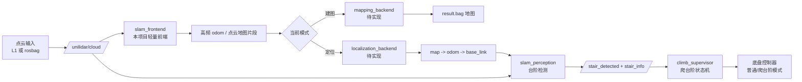
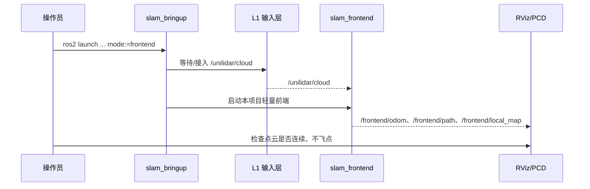
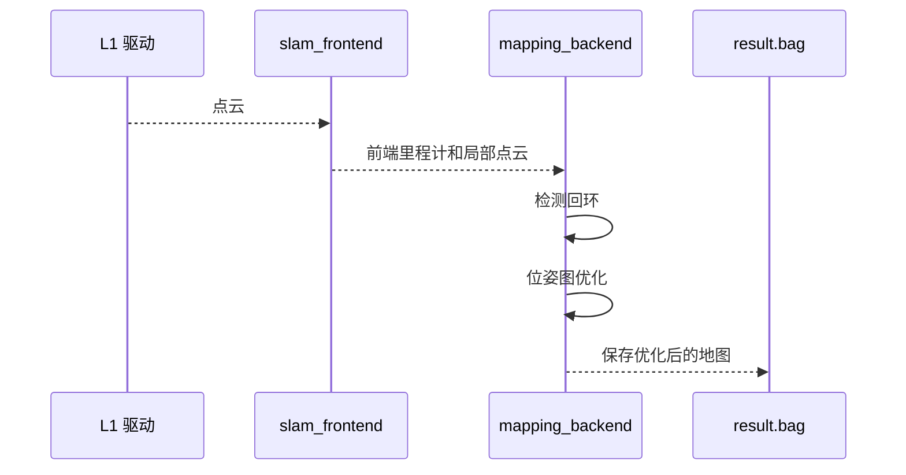
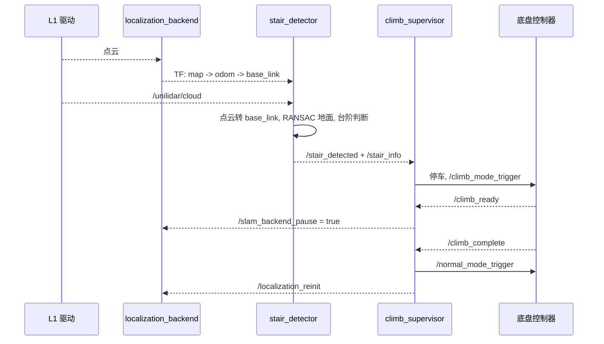

# 特种轮式小车 3D LiDAR SLAM + 感知 + 爬台阶 系统方案

> 文档版本：v2.5  
> 更新日期：2026-06-01  
> 平台：NVIDIA Jetson Orin Nano Super · 宇树 LiDAR L1 · ROS 2 Humble  
> 底盘：**特种变形轮 / 轮腿混合**（可爬台阶）  
> 确定方案：**方案 A（基于 Unitree L1；`src/` 放本项目自有 ROS 2 包；`third/` 放 vendored 第三方源码，二者并列）**

---

## 0. 先看懂这套系统

### 0.1 一句话解释

这套系统要做三件事：

1. 用 L1 雷达和 IMU 让小车知道自己在哪里，并建立 3D 地图。
2. 用前方点云判断前面是不是台阶、台阶大概多高、能不能爬。
3. 在确认可爬时，让底盘从普通行驶模式切到爬台阶模式，爬完后再恢复定位。

可以把它理解成：

```text
看见环境 -> 估计自己位置 -> 识别台阶 -> 通知底盘切换模式
```

### 0.2 三个最重要的概念

| 名词 | 可以先这样理解 | 本项目里的实现 |
|------|----------------|----------------|
| 里程计 | 小车每一瞬间相对怎么动了 | `slam_frontend` |
| 地图 | 把走过的地方拼成稳定 3D 点云 | 项目后端待实现 |
| 重定位 | 已有地图后，重新找到小车在地图里的位置 | 项目后端待实现 |

### 0.3 运行时总图



### 0.4 三种运行模式

| 模式 | 什么时候用 | 启动入口 | 结果 |
|------|------------|----------|------|
| 前端验证 | 先确认点云输入、TF、本项目轻量前端能跑稳 | `mode:=frontend` | 有 `/frontend/odom`、path、local map |
| 建图 | 第一次走环境，生成地图 | `mode:=mapping` | 生成 `result.bag` |
| 定位/执行 | 已有地图后，运行定位、感知、爬台阶触发 | `mode:=localization` | 持续定位并触发底盘 |

注意：本仓库根目录下 `src/` 和 `third/` 并列。`src/` 放本项目自研 ROS 2 包；`third/` 放固定版本第三方源码。默认前端使用本项目 `slam_frontend`，不依赖远端 `point_lio`。

### 0.5 前端验证时序



### 0.6 建图时序



### 0.7 定位 + 台阶触发时序



### 0.8 当前已经有和还缺什么

| 类别 | 状态 | 说明 |
|------|------|------|
| L1 雷达输入 | ✅ 远端已有参考驱动 | 方案基于 Unitree L1；如需纳入项目，vendor 官方驱动/SDK 包装层 |
| 本地 `slam_frontend` | ✅ 已有 | 本项目自研轻量前端，用于前端验证 |
| 本地自研代码 | ✅ 已写 | `slam_bringup`、`slam_perception` |
| 本地代码部署远端 | ❌ 未做 | 需要你明确同意后才部署 |
| 后端建图/重定位 | ❌ 未实现 / 未 vendor | 还没有项目内代码；可自研，或 vendor 固定版本的 SAM-QN、Localization-QN、GTSAM、TEASER++ |
| 底盘联调 | ❌ 未做 | 需要确认底盘 topic/service |

如果只想知道下一步做什么，看第 9 节；如果想知道每个包干什么，看第 10 节。

---

## 1. 硬件现状

| 项目 | 规格 | 状态 |
|------|------|------|
| 计算平台 | Jetson Orin Nano Super，ARMv8 8-core，7.8 GB LPDDR5 | ✅ 远端已确认 |
| GPU | Ampere nvGPU，CUDA 12.6，统一内存 | ✅ |
| 系统 | Ubuntu 22.04.x，Kernel 5.15.148-tegra，ROS 2 Humble | ✅ |
| LiDAR | 宇树 Unitree L1（4D，18 线，内置 IMU，180° FOV） | ✅ |
| 接口 | USB `/dev/unilidar_serial4 → ttyCH341USB4` | ✅ |
| 底盘 | 特种变形轮 / 轮腿混合，**可直接爬台阶** | ✅ |
| 雷达安装 | **前方偏高（仿头部），朝向前半球**，具体位姿待测量 | ⚠️ |
| TBB | `libtbb-dev 2021.5.0` | ✅ |
| GTSAM | 未装 | ❌ |
| TEASER++ | 未装 | ❌ |
| 前向深度相机 | 未确认 | ❓ |

---

## 2. 软件资产

### 远端已有参考工作区 `~/ros2_ws/`（2026-06-01 核查）

```
/home/nvidia/ros2_ws/src/
├── unitree_lidar_sdk
├── unitree_lidar_ros2   # L1 官方/已有驱动参考；需要时 vendor 到本仓库
├── point_lio_ros2      # 远端已有，仅记录；本项目默认不依赖
└── my_py_pkg
```

### 本仓库 `other/`（`src/` 自研 + `third/` vendor，二者并列）

> **边界原则：** 不依赖远端 `ros2_ws` / `slam_ws` 的现成代码。需要第三方能力时，把固定版本 vendor 到本仓库根目录 `third/`，由本项目维护。

```
other/
├── src/
│   ├── slam_frontend
│   ├── slam_bringup
│   └── slam_perception
└── third/
    └── <vendored third-party source>
```

> **待核对：** `robot_tf.yaml` 与 `unilidar_l1.yaml` 外参均为临时值，需实测后更新。

---

## 3. 需求定义

| # | 需求 | 优先级 | 属于哪层 |
|---|------|--------|---------|
| R1 | 移动中实时 3D 点云建图 | P0 | SLAM 前端 |
| R2 | 实时 6DoF 定位 | P0 | SLAM 前端 |
| R3 | 回环检测，消除漂移 | P1 | SLAM 后端 |
| R4 | 关机后地图持久化 | P1 | SLAM 后端 |
| R5 | 二次加载地图重定位 | P1 | 定位模块 |
| R6 | **前半球感知**（障碍、台阶检测） | P1 | 感知层 |
| R7 | **台阶识别**：判断前方有台阶、估算台阶高度/宽度 | P1 | 感知层 |
| R8 | **实时局部避障**（普通障碍绕开） | P1 | 规划层 |
| R9 | **爬台阶触发**：识别到可爬台阶 → 触发底盘切换爬楼模式 | P1 | 规划/运控 |
| R10 | 可选：全局自主导航（Nav2） | P2 | 规划层 |

---

## 4. 系统分层架构

```
┌──────────────────────────────────────────────────────────────────┐
│  L5  底盘运控层                                                     │
│  特种轮变形控制 · 爬台阶模式 · 平地模式切换                           │
│  ← 独立于 ROS SLAM，通过 topic/service 接收切换指令                  │
├──────────────────────────────────────────────────────────────────┤
│  L4  规划层                                          [P1~P2]       │
│  Nav2 local_planner · costmap2D · 台阶触发逻辑                     │
│  「前方台阶可爬」→ 发 /climb_trigger → 底盘切换模式                  │
├──────────────────────────────────────────────────────────────────┤
│  L3  感知层                              [P1 · 本机代码✅ 待部署]   │
│  stair_detector · climb_supervisor                                   │
│  输出：/stair_detected · /front_roi_cloud · /climb_mode_trigger      │
├──────────────────────────────────────────────────────────────────┤
│  L2  定位层                                          [P1 · 未装]    │
│  Localization-QN：加载 result.bag · Quatro+Nano-GICP 匹配          │
│  输出：map → odom TF                                               │
├──────────────────────────────────────────────────────────────────┤
│  L1  SLAM 后端（建图阶段）                           [P1 · 未装]    │
│  SAM-QN：位姿图优化 · Quatro 回环 · GTSAM · result.bag             │
├──────────────────────────────────────────────────────────────────┤
│  L0  前端里程计                                      [P0 ✅ 本机]   │
│  slam_frontend：轻量点云 ICP 里程计 · 前端验证 · odom/path/local map │
├──────────────────────────────────────────────────────────────────┤
│  L-1  传感器层                                       [P0 ✅ 远端]   │
│  unitree_lidar_ros2 → /unilidar/cloud + /unilidar/imu             │
└──────────────────────────────────────────────────────────────────┘
```

---

## 5. 核心能力详解

### 5.1 SLAM：建图 / 回环 / 存图 / 重定位

**仓库关系：**

```
本机已有：slam_frontend ✅
远端已有：point_lio 仅作对照/备用，不作为默认依赖
待实现/待适配：mapping_backend + localization_backend
L1 输入：基于 Unitree L1；如需项目内闭环，vendor 官方驱动/SDK 包装层
```

**依赖树：**

```
项目后端（待实现/待适配）— 把前端、建图、定位串在一起
├── slam_frontend               ✅ 本机已有，默认前端验证使用
├── mapping_backend             ❌ 建图回环 + 位姿图优化，输出 result.bag
│   ├── Quatro                  ❌ 可选点云配准库
│   ├── nano_gicp               ❌ 可选精配准库
│   └── GTSAM 4.1.1             ❌ 位姿图优化数学库（aarch64 约 45 min）
├── localization_backend        ❌ 加载已有地图做重定位
│   └── TEASER++                ❌ 点云粗匹配库（约 20 min）
├── slam_bringup                ✅ 本机 · ❌ 远端 — 统一 launch 入口
├── slam_perception             ✅ 本机 · ❌ 远端 — 台阶检测 + 爬楼状态机
└── L1 输入层                    ❌ 待 vendor 官方驱动/SDK 包装层或接入 rosbag
```

**三种运行模式：**

```
【前端验证模式】
  点云输入 → slam_frontend（本项目轻量前端）→ /frontend/odom + /frontend/path + /frontend/local_map
  目的：先确认点云输入、TF、本项目前端和下游感知链路能跑。

【建图模式】
  点云输入 → slam_frontend → mapping_backend（待实现）→ result.bag
  目的：第一次走完整环境，生成可持久化地图。当前只有前端和局部地图。

【定位模式】
  点云输入 → slam_frontend → localization_backend（待实现，加载 result.bag）
           → map → odom → base_link TF
  目的：已有地图后，实时定位，并给感知/底盘触发提供坐标基础。
```

---

### 5.2 前半球感知：雷达朝前装的价值

#### 雷达"头部前装"的天然优势

```
水平背装（常规）             头部前装（你的方案）
     ───                        ↗───
     车体                      /  车体
  看不到正前方地面          ✅ 可覆盖正前方地面和障碍
  台阶盲区大                 台阶盲区明显减小
```

| 区域 | 水平背装 | 头部前装（前倾） |
|------|----------|-----------------|
| 正前方 1～10m 障碍 | ✅ | ✅ |
| 前方贴地障碍（<30cm） | ⚠️ 盲区 | ✅ 覆盖 |
| 正前方台阶（阶面） | ❌ 盲区 | ✅ 可看到 |
| 车底 / 脚下 | ❌ | ❌ 仍盲 |
| 建图时点云全面度 | 强 | 偏前向，背后覆盖弱 |

> **核心结论**：头部前装对台阶识别天然有利，但**建图时背后区域覆盖弱**，建图阶段需配合走 360° 路线。

#### 安装角度建议

```
推荐：下俯 10°～20°（即 pitch = -10° ~ -20°）
  ↳ 使雷达"看"到约 1.5～4m 前方的地面和台阶阶面
  ↳ robot_tf.yaml 当前临时 pitch = -0.26 rad ≈ 15°
```

---

### 5.3 台阶检测

```
L1 点云（/unilidar/cloud）
         ↓  TF → base_link
  RANSAC 地面拟合 + 前方 ROI 高度带分析
         ↓
  输出：/stair_detected · /stair_info · /front_roi_cloud
```

已实现：`stair_detector_node.py`（本机）。参数见 `slam_perception/config/stair_detector.yaml`。

---

### 5.4 台阶触发与底盘模式切换

已实现：`climb_supervisor_node.py`（本机）。发布 `/climb_mode_trigger`、`/normal_mode_trigger`、`/slam_backend_pause`。

```
         平地行驶
              ↓
    /stair_detected = True 且高度 ≤ max_climbable
              ↓
    减速停车 → /climb_mode_trigger → 等待 /climb_ready
              ↓
    爬台阶（/slam_backend_pause = True）
              ↓
    /climb_complete → /normal_mode_trigger → /localization_reinit
```

> 底盘 topic 名称已按设计预留，**实物联调未做**。

---

## 6. TF 坐标系树

```
map
 └── odom                      ← SAM-QN / Localization-QN 发布
      └── base_link              ← robot_tf.yaml 静态 TF（临时值 ⚠️）
           └── unilidar_lidar
                └── unilidar_imu  ← robot_tf.yaml 静态 TF
```

本机 `slam_bringup/launch/robot_tf.launch.py` 已替代手工 `static_transform_publisher`，**远端未部署、外参未实测**。

---

## 7. Topic / 信号对照表

这张表只列“读系统时最该先认识”的信号，不展开所有内部 topic。

| 信号 | 谁发布 | 谁使用 | 含义 |
|------|--------|--------|------|
| `/unilidar/cloud` | L1 输入层 | `slam_frontend`、`stair_detector` | Unitree L1 点云或 rosbag 回放 |
| `/frontend/odom` | `slam_frontend` | RViz/调试/后续模块 | 本项目轻量前端输出的里程计 |
| `/frontend/path` | `slam_frontend` | RViz/调试 | 前端估计轨迹 |
| `/frontend/local_map` | `slam_frontend` | RViz/调试 | 前端累积局部点云 |
| `map -> odom -> base_link` | SAM-QN / Localization-QN / TF | 感知、导航、可视化 | 小车在地图里的位姿链 |
| `/stair_detected` | `stair_detector` | `climb_supervisor` | 前方是否检测到稳定台阶 |
| `/stair_info` | `stair_detector` | `climb_supervisor` | `[是否检测到, 高度, 距离, 宽度, 置信度]` |
| `/front_roi_cloud` | `stair_detector` | RViz/调试 | 变换到 `base_link` 后的前方 ROI 点云 |
| `/climb_mode_trigger` | `climb_supervisor` | 底盘控制器 | 请求切换到爬台阶模式 |
| `/normal_mode_trigger` | `climb_supervisor` | 底盘控制器 | 请求恢复普通行驶模式 |
| `/climb_ready` | 底盘控制器 | `climb_supervisor` | 底盘已准备好爬台阶 |
| `/climb_complete` | 底盘控制器 | `climb_supervisor` | 底盘报告台阶通过完成 |
| `/slam_backend_pause` | `climb_supervisor` | SAM-QN 适配层 | 爬台阶期间暂停/恢复后端建图 |
| `/localization_reinit` | `climb_supervisor` | Localization-QN 适配层 | 爬完后请求重定位 |

---

## 8. 风险清单

| 风险 | 等级 | 描述 | 缓解措施 |
|------|------|------|---------|
| GTSAM aarch64 编译失败 | 🔴 | 偶发链接错误 | `-DGTSAM_BUILD_WITH_MARCH_NATIVE=OFF -DGTSAM_BUILD_TESTS=OFF` |
| TEASER++ 编译 OOM | 🟡 | 8GB `-j8` 会崩 | `make -j4`，关浏览器 |
| L1 背向盲区（头部前装） | 🟡 | 建图背后覆盖弱 | 建图时走 8 字形或 360° 路线 |
| 台阶期间 IMU 振动 | 🟡 | 高频振动污染位姿图 | 爬楼时暂停 SAM-QN，LIO 继续 |
| 台阶检测误判 | 🟡 | 坡面/杂物误识别为台阶 | 加高度/连续性阈值过滤 |
| 爬楼后定位漂移 | 🟡 | 点云剧变后 LIO 累计误差 | 爬完用 Localization-QN 重匹配 |
| base_link 外参不准 | 🟡 | 感知 ROI 偏移 | 实测后更新 `robot_tf.yaml` |
| 内存不足 8GB | 🟡 | 建图 PCD 积累 | `interval: 100`，关 RViz 全局点云 |
| 散热降频 | 🟡 | 全负荷降频 | 加风扇，`nvpmodel -m 0` |

---

## 9. 开发阶段规划

> 图例：**✅ 完成** · **🔍 待部署/实车验证** · **❌ 未做**

### Phase 0 — 前端验证（1 天）

- [ ] 🔍 雷达上电，`ros2 topic hz /unilidar/cloud` 确认帧率
- [ ] 🔍 小车慢速（< 0.3m/s）行进，前端 `/frontend/odom` 连续
- [ ] 🔍 RViz：`/frontend/path` 平滑、`/frontend/local_map` 不明显撕裂

本项目部署后可跑；L1 输入层需先 vendor 官方驱动/SDK 包装层，或临时用 rosbag 提供 `/unilidar/cloud`：

```bash
ros2 launch slam_bringup system.launch.py mode:=frontend
```

---

### Phase 1 — 车体 TF 补全（1～2 天）

- [ ] 量雷达相对车体：x、z、pitch（替换 `robot_tf.yaml`）
- [x] `robot_tf.launch.py` + URDF + yaml（本机 `slam_bringup`）
- [ ] 🔍 部署远端 + `ros2 run tf2_tools view_frames` 验证

---

### Phase 2 — 编译后端依赖（半天～1 天）

- [ ] GTSAM 4.1.1 源码编译
- [ ] TEASER++ 源码编译

```bash
# GTSAM 4.1.1（约 45 min）
wget -O gtsam.zip https://github.com/borglab/gtsam/archive/refs/tags/4.1.1.zip
unzip gtsam.zip && cd gtsam-4.1.1 && mkdir build && cd build
cmake .. \
  -DGTSAM_BUILD_WITH_MARCH_NATIVE=OFF \
  -DGTSAM_USE_SYSTEM_EIGEN=ON \
  -DGTSAM_BUILD_TESTS=OFF \
  -DGTSAM_BUILD_EXAMPLES_ALWAYS=OFF
make -j4 && sudo make install

# TEASER++（约 20 min）
git clone https://github.com/MIT-SPARK/TEASER-plusplus.git
cd TEASER-plusplus && mkdir build && cd build
cmake .. -DENABLE_DIAGNOSTIC_PRINT=OFF -DBUILD_TESTS=OFF
make -j4 && sudo make install && sudo ldconfig
```

**验收：** `find /usr/local/lib -name "libgtsam*"` 有输出。

---

### Phase 3 — 完整 SLAM 建图（1～2 天）

- [ ] 实现或明确适配 `mapping_backend`
- [ ] `colcon build --symlink-install --base-paths src third`
- [ ] 🔍 闭环建图，`result.bag` 生成

后端不再默认依赖远端第三方工作区。需要先决定：

1. 自研 `mapping_backend` / `localization_backend`
2. 或在你明确同意后，把固定版本第三方后端 vendor 到本仓库根目录 `third/` 并由本项目维护

**验收：** 绕一圈回环触发，`result.bag` 生成，地图无明显重影。

---

### Phase 4 — 重定位验证（1 天）

- [ ] 配置 `map_path`，加载 `result.bag`
- [ ] 🔍 重启后定位误差 < 0.2m（3m 移动）

定位后端待实现。当前 `mode:=localization` 启动的是 `slam_frontend` + `slam_perception`，用于验证感知链路和状态机。

---

### Phase 5 — 台阶检测（2～3 天）

- [x] `stair_detector_node.py`（TF、RANSAC、时序滤波）
- [x] `climb_supervisor_node.py`（状态机、backend_pause）
- [ ] 🔍 部署远端 + 10cm 台阶实物验收（成功率 > 90%）

---

### Phase 6 — 避障 + 台阶触发（2～3 天）

- [x] `obstacle_scan.launch.py`（pointcloud_to_laserscan 节点配置）
- [ ] 安装 Nav2（`ros-humble-nav2-bringup`）
- [ ] 配置 costmap 接 `/scan`
- [ ] 🔍 障碍绕开 + 台阶触发 + 底盘联调

---

## 10. 技术栈汇总

| 层 | 包名 | 作用（一句话） | 本机 | 远端 |
|----|------|----------------|------|------|
| 启动入口 | `slam_bringup` | 统一启动传感器、TF、SLAM、感知 | ✅ | ❌ |
| 感知 | `slam_perception` | L1 点云台阶检测 + 爬楼状态机 | ✅ | ❌ |
| L1 输入层 | 待 vendor | Unitree L1 官方驱动/SDK 包装层或 rosbag，发布 `/unilidar/cloud` | ❌ | 参考已有 |
| 前端里程计 | `slam_frontend` | 本项目轻量 LiDAR ICP 里程计，用于独立前端验证 | ✅ | ❌ |
| 外部对照前端 | `point_lio` | 远端已有 LiDAR-IMU 前端，仅作参考；若使用需 vendor | — | ✅ |
| 建图后端 | `mapping_backend` | 项目待实现，回环检测 + 位姿图优化，存 result.bag | ❌ 未写 | ❌ |
| 回环依赖 | `Quatro` + `nano_gicp` | 可选点云配准/回环匹配库 | ❌ | ❌ |
| 重定位后端 | `localization_backend` | 项目待实现，加载已有地图做重定位 | ❌ 未写 | ❌ |
| 位姿图库 | GTSAM 4.1.1 | 可选位姿图优化库 | ❌ | ❌ |
| 点云匹配库 | TEASER++ | 可选粗匹配库 | ❌ | ❌ |
| 点云转激光 | `pointcloud_to_laserscan` | 3D 点云压成 2D `/scan` 给 costmap | ✅ launch | ❌ apt |
| 局部避障 | Nav2 | 路径规划 + 局部避障 | ❌ | ❌ |
| 可视化 | RViz 2 | 点云/TF 可视化 | — | ✅ |

---

## 11. 关键约束

| 约束 | 说明 |
|------|------|
| **场景** | 室内为主，< 100m 半径；L1 18 线不适合室外大场景回环 |
| **建图速度** | ≤ 0.3m/s，角速度 ≤ 20°/s；头部前装背向覆盖弱，需绕 8 字 |
| **IMU 初始化** | 每次启动静止 5s（小车停稳，雷达不晃） |
| **爬楼期间** | 暂停后端建图；`slam_frontend` 可继续输出短时里程计；爬完后重匹配 |
| **台阶高度上限** | 取决于底盘能力，`max_stair_height` 默认 0.25m |
| **内存** | 建图开 `interval: 100`，关 RViz 全局点云，监控 `free -h` |
| **散热** | 加风扇；`sudo nvpmodel -m 0` 最大功耗；监控温度 |

---

## 12. 当前进度

```
远端已有 ✅                    本机已有 · 待部署 🔍              未做 ❌
─────────────────             ─────────────────────            ──────────────
unitree_lidar_ros2            slam_frontend                 GTSAM
point_lio（对照/备用）         slam_bringup                   TEASER++
ROS 2 Humble + PCL            slam_perception                SAM-QN
                              robot_tf / URDF（临时外参）
LiDAR 设备节点                                                 Localization-QN
                                                               slam_ws
                                                               Nav2
Phase 0 前端验证 ──🔍 远端可跑，未验收
Phase 5 感知代码 ──✅ 本机完成，🔍 待部署实车验
```

---

## 13. MVP 路径与时间估算

```
Phase 0   前端验证                    1 天    ← 远端可开始 🔍
Phase 1   车体 TF 外参                1～2 天 ← 代码✅ 实测+部署🔍
Phase 2   GTSAM + TEASER++ 编译       0.5～1 天
Phase 3   完整 SLAM 建图回环          1～2 天
Phase 4   重定位验证                  1 天
────────────────────────────────────────────────
SLAM 全链路 MVP                       约 5～7 天

Phase 5   台阶检测                    2～3 天 ← 代码✅ 验收🔍
Phase 6   Nav2 避障 + 台阶触发        2～3 天 ← launch✅ Nav2❌
────────────────────────────────────────────────
完整功能                              约 10～13 天
```

---

## 14. 待确认信息

| 问题 | 为什么重要 |
|------|-----------|
| 底盘台阶模式切换接口（topic / service 名称）？ | `climb_supervisor` 联调 |
| L1 实际安装高度 + 前倾角度？ | 更新 `robot_tf.yaml`，并确认点云输入坐标系 |
| 底盘最大可爬台阶高度？ | `max_stair_height` 参数 |
| 是否有前向深度相机？ | 补充近场 0.3m 盲区 |

---

*文档 v2.5 · 2026-06-01 · 明确 `src/` 与 `third/` 并列；不依赖远端现成工作区*
