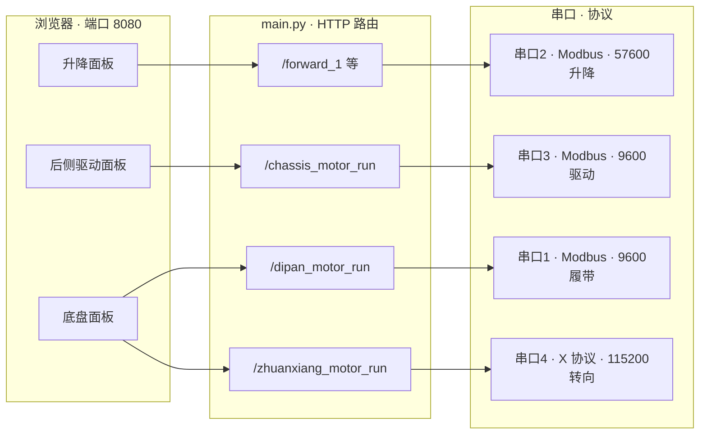
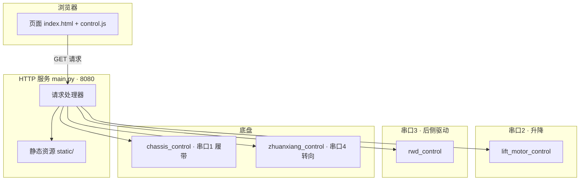
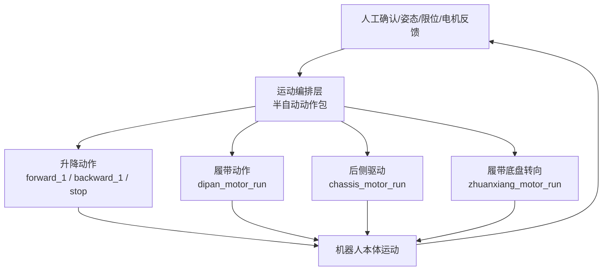

# 电机控制 Web 服务技术文档

> **适用范围**：Jetson 主机 `172.0.0.67` 上的 `~/pythonProject` 工程。  
> **Web 入口**：`http://172.0.0.67:8080/`  
> **文档版本**：2026-06-02（依据远端 `main.py` 与 `model/*` 整理）

---

## 1. 概述

本系统通过浏览器操作三类电机，由 Python 标准库 `HTTPServer` 提供 HTTP 服务，将请求转发为串口指令：

| 类型 | 业务含义 | 后端模块 | 串口设备 | 协议 |
|------|----------|----------|----------|------|
| **升降电机** | 升降机构（已观察到前升降机构 7、后升降机构 8；升/降/停/读限位） | `model/lift_motor_control.py` | `/dev/serial2` | Modbus RTU，功能码 `0x06` / `0x03` |
| **驱动电机** | 后侧双轮（速度 + 方向，含同步与差速转向） | `model/rwd_control.py` | `/dev/serial3` | Modbus RTU，功能码 `0x10` |
| **底盘电机** | 履带行走 + 履带底盘转向定位 | `model/chassis_control.py`、`model/zhuanxiang_control.py` | `/dev/serial1`、`/dev/serial4` | Modbus `0x10` + 自定义 X-Protocol |

**命名注意**：HTTP 路径 `/chassis_motor_run` 在代码中调用的是 **`rwd_control`（后侧驱动）**，不是履带底盘。履带对应 `/dipan_motor_run` → `chassis_control`。

`model/ros/` 下的 LiDAR 脚本与 8080 电机 Web **无关**，本文档不展开。

**当前能力边界**：本文档中的远端代码已经具备底层执行能力，可以分别控制升降、后侧驱动、履带和履带底盘转向；但还没有自动爬楼策略控制器。第 5 节按现场讨论整理为半自动运动逻辑，先用于人工遥控和动作验证。

### 1.1 总览：三路硬件、两套协议

物理上为 **三路串口硬件**（升降、驱动、底盘含履带与转向共四路串口，底盘占两路）；通信协议为 **两套**：**Modbus RTU**（升降 / 驱动 / 履带）与 **X 协议**（转向）。

### 1.2 运动模式口径

繁露机器人不能按普通“履带车”理解。它的核心是 **履带主驱 + 升降切换支撑状态 + 后侧双驱差速 + 履带底盘可转向**：

| 运动模式 | 支撑/接地状态 | 主执行机构 | 说明 |
|----------|----------------|------------|------|
| 履带直行 | 履带接地；现场编号 `1/2/5/6` 轮子悬空 | 履带 `/dipan_motor_run` | 普通前进/后退、接近台阶、主要爬升都优先靠履带 |
| 后轮差速转向 | 前后升降同时下降一定高度，反推车体上升，履带卸载；后轮 `5/6` 接地 | 后侧驱动 `/chassis_motor_run` | `5/6` 差速改变车体朝向；转完后升降恢复，履带重新接地 |
| 履带底盘横移 | 前后升降同时动作抬起车体，履带底盘离地/卸载 | 转向 `/zhuanxiang_motor_run` + 履带 `/dipan_motor_run` | 履带底盘可转 `+90°/-90°`，再让履带接地后前进/后退，实现“横着走” |
| 爬楼助推 | 履带为主；需要越过卡点时前后升降同时上升到合适位置 | 履带 + 后侧驱动 | 后侧驱动短距离助推，让履带重新接触/咬住地面，然后主动力回到履带 |

注意：现场机械编号 `1-8` 与 Web 控制器内部 `motor=1/2`、`id=1/2` 不是同一套编号。当前只能确定 `5/6` 对应后侧驱动这类机构、`7/8` 对应前后升降机构这类机构；具体左右/前后与 Web 参数的关系仍需低速实测。



| 协议 | 使用串口 | 控制对象 |
|------|----------|----------|
| **Modbus RTU** | 串口 1、2、3 | 履带、升降、后侧驱动 |
| **X 协议**（自定义帧 `AA 55`） | 串口 4 | 履带底盘转向 |

---

## 2. 部署与环境

| 项 | 值 |
|----|-----|
| 主机 | `172.0.0.67`（`nvidia-desktop`，Jetson Orin，`aarch64`） |
| 用户 | `nvidia` |
| 工程目录 | `~/pythonProject` |
| 入口脚本 | `main.py` |
| 监听地址 | `0.0.0.0:8080` |
| 静态资源 | `static/`（`index.html`、`js/control.js`、`css/style.css`） |
| 日志 | `log/`（经 `tool/log_config.py`） |

### 2.1 目录结构

```
~/pythonProject/
├── main.py                 # HTTP 服务与路由
├── static/                 # 前端
│   ├── index.html
│   ├── js/control.js
│   └── css/style.css
├── model/
│   ├── lift_motor_control.py   # 升降
│   ├── rwd_control.py          # 后侧驱动
│   ├── chassis_control.py      # 履带底盘
│   ├── zhuanxiang_control.py   # 转向
│   └── ros/                    # LiDAR（非本服务）
├── tool/
│   ├── crc16_modbus.py
│   └── log_config.py
└── log/
```

### 2.2 启动服务

```bash
cd ~/pythonProject
python3 main.py
```

启动后依次初始化四路串口，然后 `serve_forever()`。按 `Ctrl+C` 退出。

---

## 3. 系统架构



数据流：**按钮/表单 → 前端 Fetch GET → 路由匹配 → model 层写串口 → JSON `{ success, message [, data] }`**。

---

## 4. 三类电机控制逻辑

### 4.1 升降电机

**硬件**：两台电机，`motor_id` 为 `1` 或 `2`。  
**串口**：`/dev/serial2`，**57600** 波特率。  
**协议**：Modbus RTU，写单寄存器（功能码 **0x06**），CRC16（`tool/crc16_modbus.py`，低位在前）。

**现场编号口径**：根据现场照片与人工标注，`1/2` 是前左右轮，`3/4` 是中间支撑轮，`5/6` 是后左右轮，`7` 暂记为前升降机构 / 前升降电机，`8` 暂记为后升降机构 / 后升降电机。该编号只用于机械结构沟通，不推导自动运动逻辑。

#### 4.1.1 寄存器与动作

| 动作 | 寄存器地址 | 写入值 | 说明 |
|------|------------|--------|------|
| 正转上升 | `0x0309` | `0x0001` | 启动正转 |
| 正转停止 | `0x0309` | `0x0000` | 停止正转通道 |
| 反转下降 | `0x030B` | `0x0001` | 启动反转 |
| 反转停止 | `0x030B` | `0x0000` | 停止反转通道 |

帧格式示例（电机 1 正转）：`[motor_id, 0x06, 0x03, 0x09, 0x00, 0x01] + CRC`。

#### 4.1.2 服务端顺序逻辑（`main.py`）

为避免正反转通道冲突，HTTP 层在动作前会先停另一通道：

| 路由 | 行为 |
|------|------|
| `/forward_1?motor={id}` | `motor_stop(id, 2)` → `motor_forward(id)` |
| `/backward_1?motor={id}` | `motor_stop(id, 1)` → `motor_backward(id)` |
| `/forward_stop_1?motor={id}` | `motor_stop(id, 1)` |
| `/backward_stop_1?motor={id}` | `motor_stop(id, 2)` |
| `/backward_tongbu` | 两台 `motor_stop(·, 1)` 后，两台 `motor_backward`（**不需要** `motor` 参数） |
| `/read_state?motor={id}` | `read_limit_switch(id)`，功能码 **0x03** 读保持寄存器 `0x0B03` |

#### 4.1.3 限位与状态位

`read_limit_switch` 解析响应第 5 字节（8 位），含义包括：

| 位索引 | 含义 |
|--------|------|
| 3 | 反转状态 |
| 4 | 正转状态 |
| 5 | 下限位 |
| 6 | 上限位 |

返回 JSON 的 `message` 中含二进制状态字符串。

#### 4.1.4 控制模型小结

升降电机为 **「方向通道 + 启停」**，无速度闭环；每次写串口后约 **50ms** 延时。

---

### 4.2 驱动电机（后侧驱动）

**硬件**：后侧电机 1、电机 2。  
**串口**：`/dev/serial3`，**9600** 波特率。  
**协议**：Modbus RTU，写多个寄存器（功能码 **0x10**）。

#### 4.2.1 参数约束

| 参数 | 范围 | 说明 |
|------|------|------|
| `motor_id` | 1 或 2 | 对应不同起始寄存器 |
| `speed` | 0–100 | 0 表示停止 |
| `direction` | 0 或 1 | 0 = 正转，1 = 反转 |
| `slave_id` | 固定 1 | 从站地址写死在代码中 |

#### 4.2.2 寄存器地址

| 电机 | 起始地址 |
|------|----------|
| 电机 1 | `0x0004` |
| 电机 2 | `0x0009` |

指令结构（概念）：从站 `0x10` 写 2 个寄存器，数据区含 `direction` 与 `speed` 各一字节。

#### 4.2.3 典型用法

| 场景 | 实现方式 |
|------|----------|
| 单电机运行 | `/chassis_motor_run?id={1\|2}&speed=&dir=` |
| 停止 | `speed=0` |
| 双机同向 | 连续两次请求，`id=1` 与 `id=2`，相同 `speed`、`dir` |
| 差速转向 | 两台 `dir` 相反（如左：1 正转 2 反转） |

#### 4.2.4 控制模型小结

驱动电机为 **「速度 + 方向」** 调速模型，与升降的启停寄存器语义不同。

---

### 4.3 底盘电机

底盘在软件上分为 **两条独立链路**，共用第三块 Web 面板，但串口与协议不同。

#### 4.3.1 履带行走（`chassis_control`）

| 项 | 值 |
|----|-----|
| 串口 | `/dev/serial1`，9600 |
| 协议 | 与 `rwd_control` 相同（Modbus `0x10`，地址 `0x0004` / `0x0009`） |
| HTTP | `/dipan_motor_run?id=&speed=&dir=` |
| 网页 | 「履带行走」：方向（前/后）、速度 0–100；`id` 常用 1 |

#### 4.3.2 转向（`zhuanxiang_control`）

| 项 | 值 |
|----|-----|
| 串口 | `/dev/serial4`，115200 |
| 协议 | **X-Protocol**（帧头 `0xAA 0x55`，非 Modbus） |
| 发送 | `send_motor_cmd(addr=33, target_position, speed)` |
| HTTP | `/zhuanxiang_motor_run?target_position=&zhuanxiang_speed=` |
| 停止 | `zhuanxiang_speed=0` |

**数据包**（`build_x_packet`）：含 4 字节目标位置（支持 int32 补码）、2 字节速度、状态字（代码中 `status=7`：到位停 + 原点停 + 编码器归零等），末字节为校验和。

**反馈**（可选）：`recv_thread` 解析 23 字节帧，更新全局 `motor_data`：

```python
motor_data = {
    "motor1_current", "motor2_current",
    "motor1_target", "motor2_target",
    "motor1_limit", "motor2_limit",  # 1=未触发, 0=触发
    ...
}
```

当前 `main()` 中 **`zhuanxiang_control.start_receive()` 被注释**，故 `/data` 接口无法反映实时位置，除非重新启用接收线程。

#### 4.3.3 机械换算（代码注释）

- 转向电机走一圈：`27 × 32 = 1728`（脉冲/单位，以现场为准）
- 小车底盘电机 90°：约 `100 × 64 = 6400`（注释值，用于理解 `target_position` 量级）

#### 4.3.4 控制模型小结

| 子系统 | 模型 |
|--------|------|
| 履带 | 速度 + 方向（同驱动电机） |
| 转向 | 目标位置 + 速度（位置型） |

---

## 5. 爬楼运动逻辑（半自动验证口径）

### 5.1 设计定位

当前 Web 服务是 **执行层**：它能把“升降上升/下降、履带前进/后退、后轮差速、履带底盘转到某位置”等人工指令发到电机。

第一阶段不建议直接做全自动闭环。更稳的方式是先按人工遥控/半自动步骤验证：每次只切换一种支撑状态，确认哪组机构接地、哪组机构施力，再逐步把人工确认替换为传感器条件。

建议分层仍然保持“执行层”和“编排层”分开：



### 5.2 控制目标

运动编排的目标不是“让所有电机一起动”，而是先决定 **支撑状态**，再决定使用哪套驱动：

1. 履带直行时，履带接地，`1/2/5/6` 轮子悬空，主动力来自履带。
2. 需要普通转向时，前后升降同时下降一定高度，反推车体上升，让 `5/6` 后轮接地，再用后轮差速转向。
3. 需要横移时，前后升降抬起车体，履带底盘转 `+90°/-90°`，再让履带接地并前进/后退。
4. 爬楼时，履带仍是主动力；卡点或姿态切换阶段由后侧驱动短距离助推。
5. 升降机构不是单独的“升/降功能”，而是运动模式切换器：决定履带、后轮、履带转向机构谁能有效施力。
6. 任一关键反馈异常时，立即停止履带、后侧驱动、升降和转向，退回人工处理。

### 5.3 基础动作包

第一版先实现或人工执行这些动作包，不急于做复杂状态机：

| 动作包 | 目的 | 主要命令 | 人工/反馈确认 |
|--------|------|----------|----------------|
| `TRACK_DRIVE` | 普通前进/后退 | `/dipan_motor_run?id=1&speed=&dir=` | 履带接地，轮子悬空，运动方向正确 |
| `REAR_DIFF_TURN` | 后轮差速转向 | 升降下降到转向支撑位；`/chassis_motor_run?id=1/2&speed=&dir=` 反向 | 后轮 `5/6` 接地，车体转向，不与履带硬摩擦 |
| `TRACK_YAW_90` | 履带底盘转 `+90°/-90°` | 升降抬起车体；`/zhuanxiang_motor_run?target_position=&zhuanxiang_speed=` | 履带底盘到位，未卡滞 |
| `SIDE_DRIVE` | 横向移动 | `TRACK_YAW_90` 后执行 `/dipan_motor_run` | 车体横移方向正确 |
| `CLIMB_ASSIST` | 爬楼短时助推 | 履带低速；前后升降同时上升到合适位置；后侧驱动短推 | 履带重新接触/咬住地面，后驱停止后履带能继续推进 |
| `STOP_ALL` | 保护/急停 | 停履带、停后驱、停升降正反通道、停转向 | 全部机构停止 |

### 5.4 输入反馈

半自动阶段可以先用“能拿到的反馈 + 人工确认”，后续再接入完整传感器。

| 输入 | 来源 | 当前状态 | 用途 |
|------|------|----------|------|
| 台阶检测 | `slam_perception` / LiDAR | 本文档未接入 8080 Web | 判断是否进入爬楼流程、估计台阶距离 |
| 姿态角 | IMU / ROS 2 | 本文档未接入 8080 Web | 判断机身是否过仰、过俯或侧倾 |
| 升降限位 | `/read_state?motor=1\|2` | 已有 | 判断升降是否到上/下限，避免继续硬顶 |
| 转向位置 | `/data` | 接收线程当前注释 | 判断转向是否到位 |
| 电机命令结果 | 各 HTTP API JSON | 已有但前端部分未严格检查 | 判断串口写入是否成功 |
| 人工确认 | Web 面板 / 调试按钮 | 可直接增加 | 现场验证早期用于进入下一状态 |

### 5.5 爬楼动作顺序草案

当前讨论得到的爬楼逻辑可以先压缩为 5 段：

| 阶段 | 运动意图 | 主要动作 |
|------|----------|----------|
| 1. 接近台阶 | 履带作为主动力低速靠近 | 履带低速前进；后驱停止 |
| 2. 前端接触 | 让履带尝试搭上台阶边缘 | 履带低速保持；观察是否打滑/卡住 |
| 3. 升降切换姿态 | 前后升降同时上升到合适位置 | 升降上升；读限位；人工确认高度/姿态 |
| 4. 后驱短推 | 用后轮 `5/6` 辅助前进一段 | 后侧双驱同向短时推进；推进后立即停后驱 |
| 5. 履带继续通过 | 主动力回到履带 | 履带继续低速/中速前进；完成后停止并恢复行驶姿态 |

### 5.6 普通转向与横移逻辑

| 场景 | 动作顺序 |
|------|----------|
| 后轮差速转向 | 停履带 → 前后升降同时下降一定高度 → 后轮 `5/6` 差速 → 停后驱 → 升降恢复 → 履带重新接地 |
| 履带底盘横移 | 停履带 → 前后升降抬起车体 → 履带底盘转 `+90°/-90°` → 升降恢复让履带接地 → 履带前进/后退实现横移 |
| 恢复直行 | 停履带 → 抬起车体 → 履带底盘回正 → 履带接地 → 履带直行 |

### 5.7 第一版实现建议

第一版不要直接做全自动闭环，可以先做 **半自动动作面板或键盘脚本扩展**：

1. 每个动作只发一组明确的电机命令。
2. 动作退出先支持人工确认按钮，例如“升降到转向支撑位”“履带底盘已转 90°”“履带已重新接地”。
3. 同时记录所有电机命令、限位状态、姿态数据、目标位置和人工确认时间。
4. 现场验证通过后，再把人工确认替换为限位、姿态角、转向位置或台阶检测条件。
5. 每个动作必须有超时，超时进入 `FAIL_SAFE`。

建议新增一个独立控制模块，而不是把运动编排直接塞进现有电机驱动文件：

```text
model/
├── climb_motion_controller.py  # 半自动动作包、超时、条件判断、动作编排
├── lift_motor_control.py       # 只保留升降执行
├── rwd_control.py              # 只保留后侧驱动执行
├── chassis_control.py          # 只保留履带执行
└── zhuanxiang_control.py       # 只保留转向执行
```

HTTP 层可以先增加调试接口：

| 路径 | 用途 |
|------|------|
| `/motion/run?action=track_drive` | 执行动作包，例如履带直行 |
| `/motion/confirm?event=track_grounded` | 人工确认当前动作的退出条件 |
| `/motion/stop` | 停止所有电机 |
| `/motion/status` | 返回当前动作、上次命令、超时计时和关键反馈 |

### 5.8 现场验证清单

真实移动前建议按以下顺序验证：

1. 单机构验证：升降、履带、后侧驱动、履带底盘转向分别确认方向和停止有效。
2. 接地状态验证：履带直行时确认 `1/2/5/6` 悬空；后轮差速转向时确认 `5/6` 接地。
3. 后轮差速验证：升降下降到支撑位后，低速确认左右差速方向。
4. 履带底盘转向验证：车体抬起后，确认 `+90°/-90°` 目标位置和实际方向。
5. 横移验证：履带底盘转 90° 后，让履带低速前进/后退，确认车体横移方向。
6. 爬楼助推验证：履带接触台阶后，前后升降同时上升，后驱短推，再确认履带能继续主推进。

---

## 6. HTTP API 参考

所有接口均为 **GET**。成功时 HTTP 200，Body 为 JSON：

```json
{
  "success": true,
  "message": "说明文字",
  "data": null
}
```

`/data` 时 `data` 为 `motor_data` 对象。

### 6.1 升降电机

| 路径 | 查询参数 | 后端调用 |
|------|----------|----------|
| `/forward_1` | `motor=1\|2` | 停反转 → 正转 |
| `/backward_1` | `motor=1\|2` | 停正转 → 反转 |
| `/forward_stop_1` | `motor=1\|2` | 停正转 |
| `/backward_stop_1` | `motor=1\|2` | 停反转 |
| `/backward_tongbu` | 无 | 双机同步下降 |
| `/read_state` | `motor=1\|2` | 读限位/状态 |

### 6.2 驱动电机（路径名易混淆）

| 路径 | 查询参数 | 后端模块 |
|------|----------|----------|
| `/chassis_motor_run` | `id`, `speed`, `dir` | **`rwd_control.motor_run`** |

### 6.3 底盘

| 路径 | 查询参数 | 后端模块 |
|------|----------|----------|
| `/dipan_motor_run` | `id`, `speed`, `dir` | `chassis_control.chassis_motor_run` |
| `/zhuanxiang_motor_run` | `target_position`, `zhuanxiang_speed` | `zhuanxiang_control.send_motor_cmd(33, …)` |

### 6.4 状态轮询

| 路径 | 说明 |
|------|------|
| `/data` | 返回 `zhuanxiang_control.motor_data`；需启用 `start_receive()` 才有意义 |

### 6.5 静态资源

| 路径 | 文件 |
|------|------|
| `/` | `static/index.html` |
| `/js/control.js` | 前端逻辑 |
| `/css/style.css` | 样式 |

未匹配 API 的路径走静态文件；不存在则 404。

---

## 7. 前端页面与交互

前端文件：`static/index.html`、`static/js/control.js`。

### 7.1 页面分区

| 面板标题 | 对应电机 | 主要函数 |
|----------|----------|----------|
| 双电机正反转控制 | 升降 | `controlMotor(event, action)` |
| 后侧驱动电机控制 | 驱动 | `controlChassisMotor`、`runMotor`、`sync*`、`turn_*` |
| 底盘电机控制 · 履带行走 | 履带 | `start_dipan`、`stop_dipan` |
| 底盘电机控制 · 转向 | 转向 | `start_zhuanxiang`、`stop_zhuanxiang` |

### 7.2 前端 → API 映射

| 用户操作 | 请求 |
|----------|------|
| 电机 N 正转上升 | `GET /forward_1?motor=N` |
| 电机 N 反转下降 | `GET /backward_1?motor=N` |
| 同步下降 | `GET /backward_tongbu?motor=undefined`（后端忽略 motor） |
| 读状态 | `GET /read_state?motor=N` |
| 启动后侧电机 | `GET /chassis_motor_run?id=&speed=&dir=` |
| 同步正转/反转/停止 | 两次 `chassis_motor_run`（`runMotor` 不等待响应） |
| 左/右转 | 两台相反 `dir` |
| 履带启动/停止 | `GET /dipan_motor_run?...` |
| 转向启动/停止 | `GET /zhuanxiang_motor_run?...` |

### 7.3 前端已知行为

| 现象 | 原因 |
|------|------|
| 同步/转向按钮常立即显示成功 | `runMotor` 未处理 Promise，成功文案不依赖后端 |
| 部分停止按钮不判断 `success` | `stopChassisMotor` 等固定提示文案 |
| `m1c`、`l1` 等不更新 | `updateMotorData` 与后端 `start_receive()` 均未启用 |
| GET 带 `Content-Type: application/json` | 无 body，可省略，不影响功能 |

### 7.4 键盘遥控脚本

为便于像 `xtark_keyboard` 一样先做低速人工遥控，本仓库提供一个只依赖 Python 标准库的键盘脚本：

```bash
python3 plj/src/motor_control_web/keyboard_control.py --base-url http://172.0.0.67:8080
```

如果脚本直接在 Jetson 上运行，且电机 Web 服务监听本机 8080，可省略 `--base-url`：

```bash
python3 keyboard_control.py
```

脚本只发送本文档已有的 HTTP GET 接口，不依赖 ROS 2，也不修改后端代码。它适合单步验证运动方向、停止是否有效、组合动作是否互相抵消；不等同于自动爬楼控制器。

| 按键 | 动作 |
|------|------|
| `w` / `s` | 履带前进 / 后退 |
| `x` | 履带停止 |
| `i` / `,` | 后侧驱动前进 / 后退 |
| `a` / `d` | 后侧驱动差速左转 / 右转 |
| `k` | 后侧驱动停止 |
| `u` | 两侧升降上升 |
| `j` | 两侧同步下降 |
| `h` | 升降停止 |
| `[` / `]` | 转向目标位置减少 / 增加 |
| `p` | 转向停止 |
| `+` / `-` | 调整速度 |
| `空格` | 停止履带、后侧驱动、转向和升降 |
| `q` | 停止全部并退出 |

第一次实车运行建议使用低速：

```bash
python3 plj/src/motor_control_web/keyboard_control.py \
  --base-url http://172.0.0.67:8080 \
  --speed 15 \
  --steer-speed 150
```

---

## 8. 串口与协议附录

### 8.1 串口一览

| 串口 | 波特率 | 模块 | 电机类型 |
|------|--------|------|----------|
| `/dev/serial1` | 9600 | `chassis_control` | 履带 |
| `/dev/serial2` | 57600 | `lift_motor_control` | 升降 |
| `/dev/serial3` | 9600 | `rwd_control` | 后侧驱动 |
| `/dev/serial4` | 115200 | `zhuanxiang_control` | 转向 |

各模块使用独立的全局 `ser` 对象，互不覆盖。

### 8.2 Modbus CRC

`crc16_modbus(data)`：多项式 `0xA001`，初值 `0xFFFF`，返回 2 字节 **低字节在前**。

### 8.3 服务启动初始化顺序

```text
motor_init()              # 升降 serial2
rwd_motor_init()          # 驱动 serial3
chassis_motor_init()      # 履带 serial1
zhuanxiang_motor_init()   # 转向 serial4
# start_receive()         # 当前注释，无 485 回传
HTTPServer.serve_forever()
```

---

## 9. 三类电机对比表

| 维度 | 升降 | 驱动（后侧） | 底盘·履带 | 底盘·转向 |
|------|------|--------------|-----------|-----------|
| 电机数量 | 2 | 2 | 按 id 1/2 | 控制器 addr 33 |
| 主要变量 | 启停 + 正/反通道 | speed + dir | 同驱动 | target_position + speed |
| 典型场景 | 升平台、同步降 | 直线、差速转 | 前后履带 | 转到指定位置 |
| Web 面板 | 第一块 | 第二块 | 第三块·履带 | 第三块·转向 |
| HTTP 前缀 | `/forward_1` 等 | `/chassis_motor_run` | `/dipan_motor_run` | `/zhuanxiang_motor_run` |

---

## 10. 运维与排错

### 10.1 串口打不开

- 检查 `/dev/serial1`–`serial4` 是否存在、权限（用户是否在 `dialout` 组）。
- 确认无其它进程占用同一串口。
- 查看 `log/` 中 `lift_motor_control` / `rwd_control` 等模块的 ERROR 日志。

### 10.2 网页能开但电机无反应

- 确认 `python3 main.py` 正在运行且初始化未报错。
- 用浏览器开发者工具看 API 返回的 `success` 与 `message`。
- 区分误调接口：后侧驱动应看 `/chassis_motor_run`，履带应看 `/dipan_motor_run`。

### 10.3 转向位置/限位不刷新

- 在 `main.py` 的 `main()` 中取消注释 `zhuanxiang_control.start_receive()`。
- 在前端 `control.js` 中恢复 `updateMotorData` 与 `setInterval(..., 1000)`。

### 10.4 安全

- Web 服务绑定 `0.0.0.0`，局域网内均可访问，无鉴权；勿暴露到公网。
- SSH 与 Web 凭据勿写入版本库；建议使用 SSH 密钥。

---

## 11. 修订记录

| 日期 | 说明 |
|------|------|
| 2026-06-02 | 初版：基于远端 `~/pythonProject` 源码与 `http://172.0.0.67:8080/` 前端核对 |
| 2026-06-02 | 增加「1.1 总览：三路硬件、两套协议」中文架构图；第 3 节架构图改为中文标注 |
| 2026-06-02 | 将运动逻辑更新为现场口径：履带主驱、升降切换支撑状态、后轮差速转向、履带底盘 90° 横移、爬楼短时助推 |

---

## 相关文档

- 主机与 SSH：[项目备忘.md](../项目备忘.md)
- 文档索引：[文档索引.md](文档索引.md)
