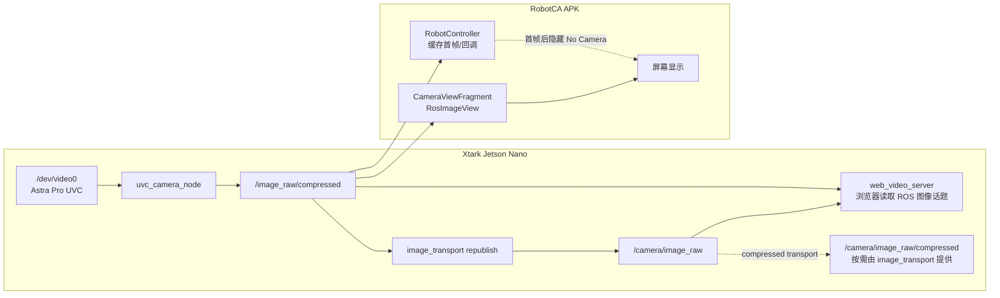

# Android 摄像头与机器人端相机功能梳理

最后整理：2026-06-16（含 `xtark@192.168.1.169` 实机探测）

相关文档：[远端硬件与传感器.md](./远端硬件与传感器.md) · [Android与xtark交互说明.html](./Android与xtark交互说明.html)

---

## 总体架构



**实机确认**：`/image_raw/compressed` 有 Android 订阅方 `android/robot_controller`、`android/fragment_camera_view`（来自 192.168.1.135），App 已连上并在收图。

**一句话**：APK 不采手机摄像头，只订阅机器人 `/image_raw/compressed` 显示；Xtark 用 UVC 采 `/dev/video0` 发布；深度相机是另一套通路，导航不依赖相机。

---

## 一、Android APK 摄像头功能

**结论：只做远程 ROS 图像显示，无本机采集、无发布、无图像处理。**

| 功能 | 情况 |
|------|------|
| 订阅机器人画面 | ✅ 默认 `/image_raw/compressed`，`sensor_msgs/CompressedImage` |
| 全屏相机页 | ✅ `CameraViewFragment` |
| 概览页（相机+激光） | ✅ `OverviewFragment` |
| 无画面提示 | ✅ 首帧前显示 “No Camera” |
| 话题可配置 | ✅ 设置页、添加/编辑机器人 |
| 本机拍照 / 录制 / OpenCV | ❌ |

**主要 UI 入口**（侧栏）：Overview（相机+激光）、Camera（纯相机）。

**订阅方**（两套并行）：

- `RobotController` — 缓存图像、首帧回调隐藏“无摄像头”提示
- `RosImageView`（`CameraViewFragment` / `OverviewFragment`）— 解码 JPEG 显示

**易混淆**：`LaserScanFragment` 里 “Lock Camera Angle” 是激光 OpenGL 视角，不是 ROS 摄像头。

**已知问题**：`CameraViewFragment` 读话题用 key `edittext_camera_topic`，设置页/`RobotController` 用 `prefs_camera_topic_edittext`，改设置后画面组件可能仍用默认话题。

代码：`android/RobotCA-master/.../control_app/`

---

## 二、Xtark 端摄像头功能

平台：Jetson Nano · ROS Melodic · `~/ros_ws` · 主机名 `xtark-robot`

### Android 验证栈会拉起的相机栈

| 进程 | 作用 |
|------|------|
| `roslaunch xtark_driver xtark_camera.launch` | 入口 |
| `uvc_camera_node` | 采 `/dev/video0`（Astra Pro FHD Camera） |
| `image_transport republish` | 订阅 `/image_raw/compressed`，发布 `/camera/image_raw`；订阅方可按需使用 `/camera/image_raw/compressed` |
| `web_video_server` | 浏览器预览（App 不用） |

### `xtark_camera.launch` 要点

- 分辨率：480p（默认 640×480）、720p、1080p，对应标定 `cam_*.yaml`
- 驱动：`uvc_camera/xtark_camera_driver.launch`
- `xtark_driver` 源码在远端 `~/ros_ws/src/xtark_driver/launch/`，本 git 仓库只保留启动脚本、文档和 `xtark_nav` 同步子集

### 图像话题

| 话题 | 说明 |
|------|------|
| `/image_raw/compressed` | **Android 默认订阅**，发布者 `uvc_node` |
| `/camera/image_raw` | republish 的基础输出，App 默认不用 |
| `/camera/image_raw/compressed` | `/camera/image_raw` 的压缩传输形式，按订阅方需求出现 |
| `/camera/camera_info` | 内参 |

导航**不依赖**相机。`android_stack.sh` 默认 `CAMERA_ENABLE=1` 拉起相机；`/dev/video0` 不存在则跳过。

### 深度相机（另一通路，Android 栈默认不启）

- 包：`xtark_nav_depthcamera`
- Launch：`xtark_depthcamera.launch`（OpenNI2 / Orbbec）
- 话题：`/camera/rgb/*`、`/camera/depth/*` 等
- 用途：3D 视觉、RTAB-Map；与 UVC 单目不同 USB 通路

---

## 三、机器人端其他已部署代码

### `~/ros_ws/src` 包（实机）

| 包 | 作用 |
|----|------|
| `xtark_driver` | 底盘、雷达、UVC 相机、EKF |
| `xtark_nav` | 2D 导航（本仓库同步子集） |
| `xtark_nav_depthcamera` | 深度相机 + RTAB |
| `xtark_cv` | 视觉 Demo：OpenCV 20+、YOLO、巡线、KCF、AR（按需 launch，非默认栈） |
| `xtark_ctl` / `xtark_apps` | 键盘遥控、激光跟随等 |
| `xtark_json_bridge` | JSON↔ROS1，TCP 8765，**不含相机** |
| `third_packages` | `rplidar_ros` 等 |

### Android 验证栈（`android_stack.sh` 当前进程）

```text
roscore
xtark_bringup.launch      # 底盘 + 雷达 + EKF
xtark_camera.launch       # UVC 相机
online_slam_move_base     # SLAM + 导航
robot_pose_in_map         # → /robot_pose_in_map（App 地图黄框）
```

### 与 App 相关的主要话题

| 话题 | 用途 |
|------|------|
| `/scan` `/odom` `/imu` `/cmd_vel` `/voltage` | 传感与控制 |
| `/map` `/move_base/*` `/robot_pose_in_map` | 建图与导航 |
| `/image_raw/compressed` | 相机画面 |

本仓库同步到机器人：`xtark/scripts/android_stack.sh`、`xtark/xtark_nav/`（`start_android.bat`）。

---

## 四、Android ↔ Xtark 相机对接

```text
手机 ──局域网──► http://192.168.1.169:11311（ROS Master，不直连 TCP）

/dev/video0
  → uvc_camera_node
  → /image_raw/compressed          ← Android 订阅
  → republish → /camera/image_raw  ← 可派生 /camera/image_raw/compressed
  → web_video_server               ← 浏览器看图

深度（需单独 launch）：
  Orbbec OpenNI2 → /camera/depth/*、/camera/rgb/*
```

两点导航走 `/move_base_simple/goal` 等，**主链路不依赖相机**。

---

## 五、与 RK3568 的关系

`rk3568/` 是独立 **ROS2 传感器盒**（`192.168.1.163`），Docker 内发 `/camera/color/image_raw`、`/scan` 等，供 WSL2/PC 联调，**不接入** Android 默认的 `/image_raw/compressed` 管线。

---

## 排障速查

```bash
# 机器人
ls -l /dev/video0
pgrep -af 'xtark_camera|uvc_camera'
rostopic hz /image_raw/compressed

# Windows 重启栈
xtark\scripts\start_android.bat start
```
